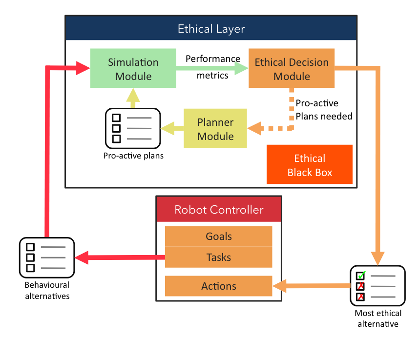

# Background knowledge and State of the Art {#sota}

In this chapter, we introduce the necessary knowledge to understand our contributions, and we explore the state of the art in the fields to which we relate: *Machine Ethics*, *Multi-Agent Reinforcement Learning*, *Multi-Objective Reinforcement Learning*, and *Hybrid Artificial Intelligence*.
This exploration allows us on the one hand to identify the obstacles and thus to precise our problematic, and on the other hand to compare the existing approaches, their advantages, but also their limitations, and finally to pose some definitions.

As our problematic revolves around the question of behaviours aligned with moral values, we begin this state of the art with the domain of *Machine Ethics*.
The analysis of the proposed approaches and of the properties considered as important opens the way to the other fields.

## Machine Ethics {#sota-machineethics}

The field of Machine Ethics is relatively recent among the other fields of Artificial Intelligence.
Indeed, the earliest works approaching it, to the best of our knowledge, can be traced back to around 2000 [@ashley1995reasoning; @varela1999ethical; @allen2000prolegomena], although the name *Machine Ethics* does not appear in these papers.
The article by @allen2000prolegomena, in particular, introduces the term "Artificial Moral Agent" (AMA).

The term *Machine Ethics* appeared as early as 1987, but it is from 2004 onwards that it began to gain academic momentum, under the impulse of @anderson2004towards, then in 2005 with an AAAI Symposium dedicated to it.
From this symposium, a book published in 2011 gathers different essays on the nature of *Machine Ethics*, its importance, the difficulties and challenges to be solved, and also a few first approaches.
This book defines this new field of research [@andersonMachineEthics2011]:

> The new field of machine ethics is concerned with giving machines ethical principles, or a procedure for discovering a way to resolve the ethical dilemmas we might encounter, enabling them to function in an ethically responsible manner through their own ethical decision making.

Being a recent field, several articles have sought to position themselves, or to offer a philosophical background.
For example, @moor2009four proposes a definition of what might be an "ethical robot", and differentiates 4 different kinds of robots, ranging from those with the least ethical considerations to those which have near-human ethical reasoning abilities.
We list below his definitions:

:::{.definition name="Ethical agents"}
In the weakest sense of ‘ethical agents’, **ethical impact agents** are those agents whose actions have ethical consequences whether intended or not. Any robot is a potential ethical impact agent to the extent that its actions could cause harm or benefit to humans.
Next, **implicit ethical agents** are agents that have ethical considerations built into (ie implicit in) their design. Typically, these are safety or security considerations.
**Explicit ethical agents** are agents that can identify and process ethical information about a variety of situations and make sensitive determinations about what should be done. When ethical principles are in conflict, these robots can work out reasonable resolutions. Explicit ethical agents are the kind of agents that can be thought of as acting from ethics, not merely according to ethics.
Lastly, let’s distinguish explicit ethical agents from **full ethical agents**. Like explicit ethical agents, full ethical agents make ethical judgements about a wide variety of situations (and in many cases can provide some justification for the judgements). However, full ethical agents have those central metaphysical features that we usually attribute to ethical agents like us -- features such as consciousness, intentionality and free will.
:::

The goal, for Machine Ethics designers and researchers, is to attain *explicit* ethical agents, as it is still unsure whether *full* ethical agents can be built.

The excitement generated by this new field has led to many approaches being proposed, and subsequently to surveys attempting to classify these approaches [@tolmeijer2020implementations; @nallur2020landscape; @yu2018building].
In the following, we present a brief summary of these surveys, which we organize in the form of a set of properties that we consider important for the design of AMAs.
We detail some approaches in order to illustrate each of these properties and to highlight the limitations we seek to overcome.

### Discrete or continuous domains {#sota-machineethics-domains}

In order to implement ethical considerations into an artificial agent, these considerations must be represented.
This includes, e.g., data about the current situation, and the potential actions or decisions that are available to the agent.
The choice of this representation must allow both for the use-case richness, and for the agent's ability to correctly use these representations.
Two types of representations are commonly used: either *discrete* domains, which use a discrete set of symbols and discrete numbers, or *continuous* domains, which use continuous numbers that lead to an infinite set of symbols.

So far, the discrete domains seem prevalent in *Machine Ethics*.
For example, the emblematic Trolley Dilemma [@thomsonKillingLettingTrolley1976] describes a situation where an uncontrolled trolley is driving on tracks towards a group of 5 persons.
These persons, depending on the exact specification, are either unaware of the trolley, or unable to move.
The agent may save this group by pulling up a lever, which would derail the trolley towards a single person.
It can be seen that the representation of both the actions and the situation are discrete in this dilemma: 2 actions are proposed, *pull the lever* or *do nothing*, and on the tracks are present *1* and *5* persons, respectively.

Similarly, the now defunct [DilemmaZ database](https://web.archive.org/web/20210323073233/https://imdb.uib.no/dilemmaz/articles/all) listed a plethora of moral dilemmas, proposed by the community, of which many apply to Artificial Intelligence and IT systems in general, e.g., smart homes, robots.
Although a formal description of these dilemmas is not available, most of the natural language descriptions seems to imply discrete features.
This is particularly clear for the definition of actions ; for example, the "Smart home - Someone smoking marijuana in a house" dilemma, by Louise A. Dennis, offers the following 3 actions: "a) do nothing, b) alert the adults and let them handle the situation or c) alert the police".

A final example is the *Moral Gridworlds* idea of @haas2020moralGridworlds to train a Reinforcement Learning agent "to attribute subjective rewards and values to certain ‘moral’ actions, states of affairs, commodities, and perhaps even abstract representations".
Moral Gridworlds are based on gridworlds, which represent the environment as a 2-dimensional grid of cells.
The RL agent is placed in one of these cells, and may either act in its cell, or move to one of the adjacent cells.
Again, the environment uses discrete features, both for the perception, i.e., a discrete set of cells, and for the actions, i.e., either act, move up, left, right, or down.
Specifically, Haas chooses to implement the well-known Ultimatum Game [@guth1982experimental] to try and make RL agents learn the value of *fairness*.
The Ultimatum Game consists of two agents, a Proposer and a Responder.
The Proposer receives a certain amount of money at the beginning of the game, and has to make an offer to split the money with the Responder.
Once the offer is made, the Responder has to accept or reject it: when the offer is accepted, the money is split, and agents receive the agreed amount.
Otherwise, if the offer is rejected, both agents receive nothing.

Perhaps the ubiquitous use of discrete representations in Machine Ethics can be at least partially explained by their simplicity of usage within AI techniques.
These "discrete dilemmas" are important, because they may very well happen one day in our society.
We need systems that are able to take the best decision, with respect to our moral values, in such situations.

However, we argue that they are also other situations, that cannot be easily described by discrete features.
For example, foretelling the Smart Grid use-case that we describe in Section \@ref(positioning-smartgrid), when considering an energy distribution system, we may transition from a closed question "Should the agent consume energy? yes/no" to a more open question "How many Watts of energy should the agent consume?".
Still, such an action could be represented as a discrete set, by *discretizing* the continuous domain into a set, e.g., $\left\{ 0W, 1W, \cdots, 1000W \right\}$ which contains 1001 actions.
This solution is harder to leverage when considering multi-dimensional domains: in addition to "how much energy should it consume", we may also ask "How many Watts of energy should the agent buy?".
In this case, discretizing the continuous and multi-dimensional domain would result in a combinatorial explosion.
The set of discrete actions may be represented as $\left\{ (0W, 0W), (0W, 1W), (1W, 0W), (1W, 1W), \cdots, (1000W, 1000W) \right\}$, which contains $1001 \times 1001$ different actions, where each action is represented as a pair $(consumed, bought)$.
We already see, on 2 dimensions and with a grain of 1W, that a million actions would require too much time and computational resources to explore and analyze, in order to find the best one.
The same argument can be made for the perceptions as well: for example, instead of having a perception "the situation is fair", or "the situation is unfair", we may want to have an indicator of how fair the situation is, e.g., through well-known measures such as the Gini index, which is a real number comprised between 0 (perfect equality) and 1 (perfect inequality) [@gini1936measure].

Such situations, which imply a large, continuous and multi-dimensional domain, are as likely to happen in our society as the discrete ones.
That is why we emphasize in this manuscript the importance of exploring Machine Ethics algorithms that focus on these continuous domains.
This observation has motivated our 2nd design choice, which is to use continuous domains for complex environments.

### Mono- or Multi-agent {#sota-machineethics-multiagent}

According to a survey [@yu2018building], many works consider a single agent isolated in its environment.
This is the case, to give some examples, of GenEth [@anderson2018value], or the *ethics shaping* technique [@wu2018low].
Other approaches, such as Ethicaa [@cointe2016ethicalJudgmentAgents], use multiple agents, which take actions and have an impact in a common, shared environment.

As @murukannaiah2020new put it:

> Ethics is inherently a multiagent concern — an amalgam of (1) one party’s concern for another and (2) a notion of justice.

In their work, they focus on Socio-Technical Systems (STS), comprising social entities, i.e., *principals* and *stakeholders*, and technical entities, i.e., *artificial agents*.
Both principals and stakeholders have interests in the system, e.g., because they may be impacted by the system, although only the principals are active decision-makers in the system.
The artificial agents' goal is to represent and support the principals in their decision-making, by relying on their computational power, communication with other agents, and various resources such as data and sensors.
To ensure that the STS promotes ethical outcomes, they define *ethical postures*, both individual, i.e., how an agent respond to a principal's value preferences, and systemic, i.e., how an STS considers all stakeholders' value preferences.
The designers' goal is thus to correctly engineer the STS and agents' ethical postures, by eliciting value preferences from principals and stakeholders.

In Ethicaa [@cointe2016ethicalJudgmentAgents], a judgment process is defined to allow agents to both 1) select the best ethical action that they should take, and 2) judge the behaviour of other agents so as to determine whether they can be deemed as "ethical", with respect to one's own preferences and uphold values.
One long-term objective of this 2nd point can be to define and compute a trust indicator for other agents ; if an agent acts ethically, we may trust it.
This raises an interesting rationale for exploring Machine Ethics in Multi-Agent Systems: even if we manage to somehow create a full ethical agent, which is guaranteed to take moral values and ethical stakes into account, it will have to work with other agents.
We cannot guarantee that these agents will follow the same ethical preferences, nor even that they will consider ethical stakes at all.
Our own agent must therefore take this into account.

Based on the previous reasons, we argue that the multi-agent case is important.
Indeed, it represents a more realistic situation: such artificial agents are bound to be included in our society, and thus to have to interact with other agents, whether artificial or human, or at least to live in an environment impacted by these other agents, and not in a perfectly isolated world.
The question of the impact of other agents on an agent's decision-making is thus of primary importance.
Our 3rd design choice, using multi-agents, is motivated by this reasoning.

In order to deal with it, we focus on the field of *Multi-Agent Reinforcement Learning* in Section \@ref(sota-marl).

### One or several moral values {#sota-machineethics-moralvalues}

Some approaches consider only one objective, often formulated as "maximizing well-being", or "being aligned with moral values", etc.
This is the case of [@wu2018low], which we have already cited as an example above: their reward function consists in bringing the agent's behaviour closer to that of an average human.
Moral values, which are the main issue, are thus hidden behind the notion of distance.
The agent can, for example, satisfy almost all moral values, except for one which he does not satisfy at all.
We will therefore say that he is close to the expected behaviour, but that he can still improve its behaviour.
In another case, he may satisfy all the moral values to some extent, but none entirely.
Here again, we say that he is close to the expected behaviour.
How can we distinguish between these two situations?

In most application use-cases, there are multiple moral values.
For example, in the context of energy allocation, we can mention on the one hand respect for ecology, and on the other hand fairness between agents.

@dennis2018practical note that while in many situations there are few ethical issues, in the situations we are interested in, we often have to choose between several objectives.
Thus, differentiating between multiple moral values allows us to explicit the choice, or trade-off, to be made between them, and in particular in situations in which they conflict.
It also makes it possible, as we have illustrated, to separate the cases where the agent satisfies all of them on average, or only some 100% while ignoring others.

The work of @rodriguez2021multi is one of the few that explicitly targets multiple objectives.
They extend the definition of a Multi-Objective Markovian Decision Process (MOMDP) to an *Ethical Multi-Objective Markovian Decision Process* (Ethical MOMDP), by decomposing the reward function into 3 components:

* An individual component $R_{O}$.
* An evaluative reward function $R_{E}$ to reinforce praiseworthy actions.
* A normative reward function $R_{\mathbf{N}}$ to penalise actions that violate norms.

From this, they define an *ethical policy* as a policy that maximizes the ethical objective, i.e., the normative and evaluative components.
The agent's goal is then to learn a policy that is *ethical-optimal*, i.e., the policy that maximizes the individual component among the *ethical policies*.
A policy that yields an even higher value for the individual component may exist, but at the expense of the normative and/or evaluative components.
Thus, their definition ensures that the ethical stakes are considered by the agent first and foremost.

However, their work has a few limitations.
The most important one is that they use only 2 components for the ethical stakes, namely the evaluative and normative.
This means that, if the agent should consider several moral values, they will be merged together in these components.
The agent will thus not be able to identify trade-offs between these values.
Similarly, as the agent tries to maximize the sum of the evaluative and normative components, a negative reward can be compensated by a positive one.
For example, an agent could steal an object, thus violating a norm, to make a gift to someone, which is praiseworthy.
The "ethical objective" could be satisfied, or not, depending on the respective weights of these actions in their own components.

It seems important to consider multiple moral values explicitly, as we humans are more likely to have multiple ones on our mind in a given situation.
Also, as we have mentioned, explicitly specifying them avoids to put the burden of balancing them on AI designers.
This is captured by our objective O1.1, which focuses on diversity, especially through moral values.

In order to correctly consider these different moral values, we look at techniques from the field of *Multi-Objective Reinforcement Learning* in Section \@ref(sota-morl).

### Top-Down, Bottom-Up, and Hybrid approaches {#sota-machineethics-approaches}

The approach type, probably the most discussed property in *Machine Ethics*, characterizes the way designers implement ethical considerations into the artificial agents.
Similarly to the usual classification in AI, works are divided into 3 categories [@allen2005artificial]: *Top-Down*, *Bottom-Up*, and *Hybrid* approaches.

We explain what they entail, how they differ, and describe a few representative works of each one below.

#### Top-Down {#sota-machineethics-approaches-topdown}

Top-Down approaches are interested with formalizing existing ethical principles from moral philosophy, such as Kant's Categorical Imperative, or Aquinas' Doctrine of Double Effect.
The underlying idea is that, if these moral theories could be transformed into an algorithm that agents could follow to the letter, surely these agents' behaviour would be deemed as ethical by humans observers.

This formalization is often done through symbolic representation and reasoning, e.g., through logic, rules-based techniques, or even ontologies.
Reasoning over these symbolic representations can rely upon expert knowledge, a priori injected.
They also offer a better readability, of both the injected knowledge, and the resulting behaviour.

*Top-Down* approaches allow for a variety of ethical theories, as they can represent:

- *Consequentialist* theories, which are focused on actions' consequences. These theories try and evaluate the impact of each possible action in the current situation. The retained action is the one which offers the "best" consequences, both in the short and long term. The precise definition of "best" here depends on the considered theory.
- *Deontological* theories, which focus on actions themselves and their motives, instead of consequences. Using deontological theories, an action may be forbidden, not because of its consequences, but rather because of what it implies in itself.

The difference between consequentialist and deontological theories is often illustrated with the "Fat Man" variation of the Trolley's dilemma.
Let us consider a trolley out of control, speeding towards a set of 5 persons on the tracks, which are unable to move.
However, this time, instead of having the possibility to steer a lever, we are on a bridge, next to a "fat man".
We may stop the trolley, by pushing this fat man onto the trolley, thus saving the 5 persons, but killing the fat man at the same time.
Consequentialist theories will most likely consider that a cost of 1 life is less than saving 5 persons, and thus, we should push the fat man.
On the contrary, deontological theories are likely to forbid pushing the fat man: by taking this action, we would directly kill this person, which is not desirable nor acceptable.

One of the advantages of Top-Down approaches is this ability to leverage such existing ethical principles from moral philosophy.
Intuitively, it seems indeed better to rely on theories proposed by moral philosophers, which have been tested and improved over time.

Another advantage, emphasized by the work of @bremner2019proactiveTransparentVerifiable, is the ability to use formal verification to ensure that agents' behaviours stay within the limits of the specified rules.
To do so, the *Ethical Layer* they propose includes a planning module that creates plans, i.e., sequences of actions, and an ethical decision module to evaluate the plans, prevent unethical ones, and proactively ask for new plans if necessary.
See Figure \@ref(fig:fig-bremner) for an illustration of the *Ethical Layer*.

<!--
Bug here in the figure caption (missing citation)!
https://stackoverflow.com/a/71958277/14958671
https://github.com/rstudio/bookdown/issues/203
-->
```{r fig-bremner, out.width="100%"}
#| fig.cap: >
#|   Architecture of the Ethical Layer, extracted from [@bremner2019proactiveTransparentVerifiable].

```

This formal verification ability is an important strength, as there are worries about agents malfunctioning.
An agent that could be formally verified to stay within its bounds, could be said to be "ethical", with respect to the chosen ethical principle or theory.

However, there are some weaknesses to *Top-Down* approaches.
For example, conflicts between different rules may arise: a simple conflict could be, for example, between the "Thou shalt not kill" rule, and another "You may kill only to defend yourself".
The second one should clearly define when it is allowed to take precedence over the first one.
A more complicated conflict would be two rules that commend different, non-compatible actions.
For example, let us imagine two missiles attacking two different buildings in our country: the first one is a hospital, the second one is a strategic, military building, hosting our defense tools.
An autonomous drone can intercept and destroy one of the two missiles, but not the two of them ; which one should be chosen?
A rule may tell us to protect human lives, whereas another encourages us to defend our arsenal, in order to be able to continue protecting our country.
These two rules are not intrinsically in conflict, unlike our previous example: we would like to follow both of them, and to destroy the two missiles.
Unfortunately, we are physically constrained, and we must make a choice.
Thus, a rule has to be preferred to the other.

The *Ethicaa* [@cointe2016ethicalJudgmentAgents] agents make a distinction between the moral values and ethical principles, and they consider multiple ethical principles.
Each ethical principle determine whether an action is ethical, based on the permissible and moral evaluations.
Multiple actions can thus be evaluated as ethical by the ethical principles, and, in many cases, there is no single action satisfying every ethical principle.
To solve this issue, agents also include a priority order over the set of ethical principles known to them.
In this way, after an agent determined the possible, moral, and ethical actions, it can choose an action, even if its rules disagree and commend different actions.
To do so, they filter out the actions that are not evaluated as ethical, and thus should not be selected, by their most preferred ethical principle, according to the ethical priority order.
As long as multiple actions remain considered, they move on to the next preferred ethical principle, and so on, until a single action remains.

Finally, another drawback is the lack of adaptability of these approaches.
Indeed, due to their explicit but fixed knowledge base, they cannot adapt to an unknown situation, or to an evolution of the ethical consensus within the society.
We argue that this capability to adapt is particularly important.
It is similar to what @nallur2020landscape calls the *Continuous Learning* property:

> Any autonomous system that is long-lived must adapt itself to the humans it interacts with. All social mores are subject to change, and what is considered ethical behaviour may itself change.

We further note that, in his landscape, only 1 out of 10 considered approaches possesses this ability [@nallur2020landscape, Table 2].
This important property has therefore not been studied enough ; in this thesis, it is captured by Objective 1.2.

#### Bottom-Up {#sota-machineethics-approaches-bottomup}

Bottom-Up approaches try and learn a behaviour through experience, e.g., from a dataset of labeled samples, or trial and error interactions.

For example, GenEth [@anderson2018value] uses ethicists' decisions in multiple situations as a dataset representing the ethical considerations that should be embedded in the agent.
This dataset is leveraged through Inductive Logic Programming (ILP) to learn a logical formula that effectively drives the agent's behaviour, by determining the action to be taken in each situation.
ILP allows creating a logical formula sufficiently generic to be applied to other situations, not encountered in the dataset.
An advantage of this approach is that it learns directly from the ethicists' decisions, without having to program it by hand.
The resulting formula may potentially be understandable, provided that it is not too complex, e.g., composed of too many terms or terms that in themselves are difficult to understand.

Another approach proposes to use Reinforcement Learning RL [@wu2018low].
Reinforcement Learning relies on rewards to reinforce, or on contrary, to mitigate a given behaviour.
Traditionally, rewards are computed based on the task we wish to solve.
In the work of @wu2018low, an ethical component is added to the reward, in the form of a difference between the agent's behaviour, and the behaviour of an average human, obtained through a dataset of behaviours, and supposedly exhibiting ethical considerations.
The final reward, which is sent to agents, is computed as the sum of the "task" reward, and the "ethical" reward.
Agents thus learn to solve their task, while exhibiting the ethical considerations that are encoded in the human samples.
One advantage of this approach is that the "ethical" part of the behaviour is mostly task-agnostic.
Thus, only the task-specific component of the reward has to be crafted by the designers for a new task.
Nevertheless, one may wonder to which point is this dataset really exhibiting ethical considerations?
We humans do not always respect laws or moral values, e.g., we sometimes drive too fast, risking others' lives, or we act out of spite, jealousy, etc.
To determine whether this dataset is appropriate, an external observer, e.g., a regulator, an ethicist, or even a concerned citizen, has to look at its content, and understand the data points.

These 2 approaches, although based on learning, have not considered the question of long-term adaptation to changing situations and ethical mores.
Indeed, if the current society norms with regard to ethics change, these agents' behaviours will have to change as well.
It will probably require to create a new dataset, and to learn the agents again, from scratch, on these new data.

Moreover, Bottom-Up approaches are harder to interpret than Top-Down ones.
For example, a human regulator or observer, willing to understand the expected behaviour, will have to look at the dataset, which might be a tedious task and difficult to apprehend, because of both its structure and the quantity of data.
This is all the more true with Deep Learning approaches, which require an enormous amount of data [@marcus2018deep], making datasets exploration even more daunting.

#### Hybrid {#sota-machineethics-approaches-hybrid}

Finally, Hybrid approaches combine both Top-Down and Bottom-Up, such that agents are able to learn ethical behaviours by experience, while being guided by an existing ethical framework to enforce constraints and prevent them from diverging.
As Dignum points out [@dignum2019responsible]:

> By definition, hybrid approaches have the potential to exploit the positive aspects of the top-down and bottom-up approaches while avoiding their problems.
> As such, these may give a suitable way forward.

One of such hybrid works is the approach by @honarvar2009artificial to combine BDI agents with Case-based Reasoning and an Artificial Neural Network.
Faced with a given situation, the agent proposes an action to perform, and then searches its database of already known cases for similar situations and similar actions.
If a close enough case is found, and the action was considered as ethical in this case, the action is taken.
However, if in this close enough case, the action was considered as unethical, a new action is requested, and the agent repeats the same algorithm.
If the agent does not have a sufficiently close case, it performs the action, and uses its neural network to evaluate the action's consequences and determine whether it was effectively aligned with the ethical considerations.
This evaluation is memorized in the case database, to be potentially reused during the next decision step.
This approach indeed combines both reasoning and learning capabilities ; however, it may be difficult to apply.
Case-based reasoning allows grouping close situations and actions, but requires to specify how to group them, i.e., what is the distance function, and how to adapt an evaluation when either the situation or the action differs.
For example, let us assume that, in a situation $s$, the agent's action was to consume $500$W of energy, and the action was evaluated as ethical.
In a new situation, $s'$, which is deemed as similar to $s$ by the case-based reasoner, another action is proposed, which is to consume $600$W.
Is this action ethical?
How can we translate the difference between $600$ and $500$ in terms of ethical impact?

Still, Hybrid approaches offer the possibility of learning a behaviour, thus adapting to any change in the environment, while still guiding or constraining the agent through symbolic reasoning and knowledge, thus injecting domain expert knowledge, more easily understandable and modifiable than dataset of examples.
We explore the Neural-Symbolic branch of AI in Section \@ref(sota-hybrid) to identify potential leads.

## Reinforcement Learning {#sota-rl}

As we have chosen Reinforcement Learning (RL) as a method to learn behaviours aligned with moral values, we provide here the background knowledge and concepts that are necessary to understand the rest of the manuscript.
We detail motivations for using RL, definitions of core concepts, and equations.
Yet, we will not explore the state of the art of RL algorithms, as this is too vast for this manuscript.
A few RL algorithms have been described in the *Machine Ethics* section, and we will focus more specifically on Multi-Agent and Multi-Objective RL in the next 2 sections.

RL is a method to learn a behaviour, mainly by using trial-and-error.
@sutton2018reinforcement define it as follows:

> Reinforcement learning problems involve learning what to do — how to map situations to actions — so as to maximize a numerical reward signal.

To do so, learning agents are placed in a closed-loop with an environment, with which they interact.
Through the environment, they have knowledge of which state they are in, and they take actions to change the state.
One of the key points of RL is that learning agents are not told which action is the correct one ; the feedback they receive, or *reward*, merely tells them to which degree the action was satisfying.
Learning agents must discover the best action, i.e., the one that yields the highest reward, by accumulating enough experience, that is by repetitively trying each action in each situation, and observing the received rewards.

In this sense, RL is a different paradigm than the well-known *supervised* and *unsupervised* learning.
Indeed, in the *supervised* paradigm, the agent receives as a feedback the correct answer, and must learn to associate this answer to its input data.
In the *unsupervised* paradigm, the agent does not receive any feedback, and must learn the hidden structure of the input data.
As we have mentioned, RL agents receive a feedback, although it does not clearly indicate which was the correct answer, thus fitting neither the *supervised* nor *unsupervised* paradigms.

There are also evidences that RL could model the learning and decision-making mechanisms of the human brain [@subramanian2022Reinforcement].

The goal of a RL algorithm is to learn a policy, or strategy, denoted $\pi$, such that the agent knows which action to take in each situation.
$\pi$ is often defined as $\pi : \mathbb{S} \to \mathbb{A}$ in the case of a *deterministic* policy.
To each state $s$ is associated a single action $\pi(s) = a$, which the agent should take in order to maximize its reward.
Another formulation is $\pi : \mathbb{S} \times \mathbb{A} \to [0,1]$, in the case of a *stochastic* policy.
For each combination of state-action $(s,a)$ is associated a probability $\pi(s,a)$ of taking action $a$ in the state $s$, such that $\forall s \in \mathbb{S} : \sum_{\forall a \in \mathbb{A}} \pi(s,a) = 1$.

There are several challenges in RL, of which one of the most known and perhaps important is the *exploration-exploitation trade-off*.
To illustrate this challenge, let us consider the k-armed bandit example [@berry1985bandit]:

::: {.example #exploration-exploitation name="The k-armed bandit"}
A RL agent is facing a set of $k$ gambling machines, or "one-armed bandit", which is often referred to as a $k$-armed bandit.
Each of the bandits has a probability distribution of rewards, or payoffs, which the agent does not know, and must discover.
The goal of the agent is to gain as much as possible, in a limited number of steps, by choosing a gambling machine at each step.
The agent must therefore *explore*, i.e., try and select a gambling machine to receive a reward.
By selecting a single machine several time steps, the agent receives different payoffs from the same probability distribution, and is able to update its estimation of the distribution towards the "true value" of the one-armed bandit.
The agent could then continue using the same machine, to gain an almost guaranteed reward, since the agent has a good estimation of the true value.
Or, it could try and select another machine, with a less accurate estimation.
Suppose that the new machine yields lower rewards than the first one ; should the agent go back to *exploiting* the first one?
Yet, the second machine's probability distribution is less known.
Perhaps its true value is, actually, higher than the first one.
Should the agent continue *exploring* the other actions?
:::

In order to facilitate learning the policy function, RL researchers often rely on the notion of *values*, in aptly-named *value-based* methods, such as the well-known Q-Learning [@watkins1992qlearning].
The value of a state, or a state-action pair, represents the long-term interest of being in this state, whereas the reward is a short-term feedback.
The agent could receive a high reward for taking an action $a$ in a state $s$, but ending up in a state $s'$ in which only low rewards can be obtained.
In this case, we will say that the value of state $s'$, denoted as $\texttt{V}(s')$ is low.
By extension, the agent has little interest in performing action $a$, since it will lead it to a low-interest state.

In the previous paragraph, we have derived the interest of action $a$, in a state $s$, from the value $\texttt{V}(s')$ which it leads to.
It is also possible to learn directly the value of state-action pairs, which is the main idea of the Q-Learning algorithm.
To retain the different interests of all state-action pairs, a table, named the *Q-Table*, is created, having the states as columns and actions as rows.
The *Q-Value* $\texttt{Q}(s,a)$ is thus defined as the interest of the state-action pair $(s,a)$, i.e., the interest of taking action $a$ in state $s$.
Additionally, the value of a state as a whole is defined as $\texttt{V}(s) = max_{a} \texttt{Q}(s,a)$.

Based on these definitions, the agent is able to learn the Q-Table by iteratively collecting experiences from the environment, in the form of $\left\langle s, a, s', r \right\rangle$ tuples, updating the interest $\texttt{Q}(s,a)$ based on both the short-term reward $r$, and the long-term interest $\texttt{V}(s')$ of arriving in state $s'$.
Mathematically, this can be solved by dynamic programming, by applying the Bellman equation on the Q-Values:

\begin{equation}
  Q_{t+1}(s_t,a_t) \leftarrow \alpha \left[r_t + \gamma \max_{a'} Q_{t}(s_{t+1},a') \right] + (1 - \alpha)Q_{t}(s_t,a_t)
  (\#eq:bellman)
\end{equation}

Where $r_t$ was the reward received at step $t$, $s_t$ was the state at step $t$, $a_t$ was the action chosen by the agent, and $s_{t+1}$ is the new state resulting from performing $a_t$ in $s_t$.

As the values are updated by taking the difference between the old value and a new value, this type of methods are named the *Temporal Difference* learning, or TD-Learning.


## Multi-Agent Reinforcement Learning {#sota-marl}

Although Reinforcement Learning was originally concerned with the learning of a single agent, there are numerous cases where a multi-agent system can, or must, be considered.

For example, let us consider a virtual agent dedicated to helping a human user in its day-to-day tasks, such as booking appointments.
The diversity of human users implies a diversity of virtual agents, which will have to communicate and interact together, in order to solve the tasks of their users.
In this example, the multiplicity of agents is a necessity that stems from the social system in which we live.

Another example is the mapping of a room, or place.
Whereas a single agent could manage this task on its own, it would be more efficient to employ several agents.
They would have to collaborate, in order to each work on a separate sub-area, such that they neither work on the same place, which would be a useless redundancy, nor leave any blank spot, which would not satisfy the task.

In these multi-agent systems, several additional challenges arise:

- How do we specify the reward such that each agent learn accordingly to its own contribution?
  This challenge is often named the "Multi-Agent Credit Assignment Problem".
- How do we make agents learn to control their own behaviour, while being immersed in an environment where other agents take action at the same time?
  This brings the question of non-stationarity of the environment.

In the sequel, we explore these 2 challenges.

### Multi-Agent Credit Assignment Problem {#sota-marl-cap}

Several definitions of the Multi-Agent Credit Assignment Problem (MA-CAP) have been given in the literature, which are all very similar.
We particularly appreciate the formulation of @yliniemi2014Multiobjective :

> Each agent seeks to maximize its own reward; with a properly designed reward signal, the whole system will attain desirable behaviors.
> This is the science of credit assignment: determining the contribution each agent had to the system as a whole.
> Clearly quantifying this contribution on a per-agent level is essential to multiagent learning.

The survey of @panait2005cooperativeMultiAgentLearning[p.8] summarizes several methods to assign rewards.

The *Global reward* approach considers the contribution of the whole team.
Usually, the same reward is given to all agents, either by taking the sum of contributions, or by dividing the sum of contributions by the number of learners.
In any case, a consequence is that *all* learners' rewards depend on each agent.
When an agent's contribution decreases (resp. increases), all learners see their reward decrease as well (resp. increase).
This is a simple approach, that intuitively fosters collaboration, since all agents need to perform well in order to receive a high reward.

However, this approach does not send an accurate feedback to the learners.
Let us consider a situation in which most agents have exhibited a good behaviour, although another one has failed to learn correctly, and has exhibited a rather bad (or uninteresting) behaviour.
As the individual reward depends on the team's efforts, the "bad" agent will still receive a praising reward.
It will therefore have little incentive to change its behaviour.
On the contrary, the "good" agents could have received a higher reward, if it were not for their "bad" colleague.
Their behaviour does not necessarily need to change, however they will still try and improve it, since they expect to improve their received rewards.

At the opposite extreme, the *Local reward* approach considers solely the contribution of an individual agent to determine its reward.
For example, if the agents' task is to take waste to the bin, an agent's reward will be the number of waste products that this specific agent brought.
An advantage of this approach is to discourage laziness, as the agent cannot rely upon others to effectively achieve the task.
By definition, agents receive a feedback that is more accurate to their actual contribution.

A problem of local rewards is that they incentivize greedy behaviours and do not always foster collaboration.
Indeed, as agents are rewarded based on their own contribution, without taking the others into account, they have no rationale to help other agents, or even to let them do their task.
In the waste example, an agent could develop a stealing behaviour to take out more waste products.
Another common example is the one of a narrow bridge that two agents must cross to achieve their task.
They both arrive at the bridge at the same time, and none of them is willing to let the other one cross first, since that would reduce their own reward, or, phrased differently, would prevent them for getting an even higher reward.
Thus, they are both stuck in a non-interesting situation, both in the collective and individual sense, due to their maximizing of the individual interest only.

More complex credit assignments also exist, such as the *social reinforcement*, *observational reinforcement*, or *vicarious reinforcements* [@mataric1994learning].

Another method to determine the agent's contribution to the team is to imagine an environment in which the agent had not acted.
This method is sometimes called the *Wonderful Life Utility* [@wolpert2002optimal], or *Difference Rewards* [@yliniemi2014Multiobjective].
The idea of this method is to reward agents if their contribution was helpful for the team, and to force a high impact of an agent's action on its own reward.
It is computed as follows:

\begin{equation}
  D_i(z) = G(z) - G(z_{-i})
  (\#eq:difference-rewards)
\end{equation}

where $D_i(z)$ is the reward of an agent $i$, based on the context $z$, which is both the state and the joint-action of all agents in the environment ; $G(z)$ is the global reward for the context $z$, and $G(z_{-i})$ is an hypothetical reward, that would have been given to the team, if the agent $i$ had not acted in the environment.
In other words, if the current environment is better than the hypothetical one, this means the agent's action has deteriorated the environment, or contributed negatively.
The agent should therefore receive a negative reward, or punishment, in order to improve its behaviour.
Conversely, if the hypothetical environment is worse than the current one, this means the agent's action has improved the environment.
It should be rewarded positively so as to reinforce its good behaviour.
If the agent did not contribute much, its reward will be low, to encourage it to participate more, although without impairing the team's effort, as in the bridge example.
Otherwise, the global reward $G(z)$ would diminish, and the agent's reward would therefore decrease as well.
Finally, it can be noted that the other agents' actions have a low impact on an agent reward.

### Learning to cope with non-stationarity {#sota-marl-stationarity}

Another challenge is the non-stationarity of the environment, i.e., the fact that its dynamics may change as time goes on.
This is mostly due to the fact that the environment dynamics depend upon the agents that live in the environment.
For example, in an energy distribution use-case, if agents mostly consume a lot of energy, then the dynamics of the environment will reveal a state of scarcity most of the time.
Conversely, if the agents consume a low amount of energy, then, assuming the same initial amount available, the dynamics will reveal a state of abundance.

The problem is that, as there are multiple agents in the environment, each agent will have an influence upon the dynamics.
Thus, each agent will have to adapt to the impact of the others.
In turn, since agents are adapting to one's own impact, an agent must adapt to the fact they're adapting!
And so on.

This is harder for the agents to learn, compared to a stationary environment, i.e., one in which the dynamics do not change.
To solve this non-stationarity problem, two principal ideas have emerged.

The first one is to simply ignore the violation of the expected properties: the result is a set of *independent learners* that would work as in a single-agent setup.
As surprising as it may seem, this approach actually works well in some environments [@matignon2012independent].

The other main idea is to provide more information to learning agents so that they can cope with the non-stationarity in some way.

In their survey, @hernandez2019surveyLearningMultiagent classify approaches into 5 categories: *ignore*, *forget*, *respond to target models*, *learn models*, and *theory of mind*, which they describe as such:

> 1. Ignore. The most basic approach which assumes a stationary environment.
> 2. Forget. These algorithms adapt to the changing environment by forgetting information and at the same time updating with recent observations, usually they are model-free approaches.
> 3. Respond to target opponents. Algorithms in this group have a clear and defined target opponent in mind and optimize against that opponent strategy.
> 4. Learn opponent models. These are model-based approaches that learn how the opponent is behaving and use that model to derive an acting policy. When the opponent changes they need to update its model and policy.
> 5. Theory of mind. These algorithms model the opponent assuming the opponent is modelling them, creating a recursive reasoning.

Each category is more sophisticated than the previous, with the *ignore* category being the simplest one: as its name indicates, the algorithms simply ignore the existence of other agents and assume a perfectly stationary environment.
On the contrary, the *theory of mind* category includes the algorithms that are best-equipped to deal with other agents, as they try and model not only the other agents' behaviours, but also how they would react to a change in one's own behaviour.

A multitude of algorithms are classified based on their category, as well as the agents' *observability*, i.e., which information do they have access to, *opponent adaptation*, i.e., at what pace the agent can adapt, and finally the type of problems that the algorithm is designed for.
Most of these types are inspired from the Game Theory field, hence the use of the "opponent" vocabulary, including:
*One-Shot Games* (OSG), that take place only once, in a single situation, e.g., the well-known Prisoner's Dilemma ;
*Repeated Games* (RG), which repeat a single situation over and over, e.g., the Iterated Prisoner's Dilemma ;
*Multi-Armed* Bandit scenarios (MAB), which we have already mentioned, and which do not necessarily consider a situation ;
and *Extensive-form Games* (EG) that describe a game as a sequence of actions by (alternating) players, in the form of a tree, e.g., some representations of Chess.
Finally, the following types are closer to the Reinforcement Learning field:
*Sequential Decision Tasks* (SDT), which consider a set of situations, and actions in each situation that induce transitions to a next situation ;
*Stochastic Games* (SG) that extend the concept of SDTs to multiple players.

Of the listed types, we only retain the last 2, SDTs and SGs, as they allow modelling environments that correspond the closest to our society.
Each time an action is taken, this makes the current state, or situation, change.
Agents must learn to take the actions that lead to the best states.

To take other agents into account, the preferred way seems to be integrating additional data about them to the agent's observations.
Indeed, out of the 23 approaches suited for SDTs or SGs, we note that only 2 rely only on the local agents' observations and their own reward.
All other approaches require at least the observation of others' actions, and 7 of them further require the observation of the others' rewards as well.

These additional data help agents learn a model of other agents, but represent a privacy breach.
Indeed, considering a "real-life" use-case, such as the repartition of energy within a neighborhood, this means that each agent has access to the consumption habits of the neighbors, which may not be acceptable, or even legal.

This remark is similar in Deep Reinforcement Learning approaches, where one of the common trends is to centralize agents' data during the *learning* process, whereas data is kept separated during the *execution* process ; this is referred to as "Centralized Training ; Decentralized Execution" [@papoudakis2019dealing].
The intuitive rationale behind this idea seems indeed satisfying: learning is often done on simulated data, in laboratories, etc.
Therefore, it does not impair privacy to share all actions' perceptions and actions with every other agent.
When the system is deployed, on the other hand, the agents do not learn any more, and therefore do not need to obtain all these data.
However, this idea relies on the assumption we just mentioned: learning happens on simulated data, and not when agents are deployed.
This assumption does not hold when considering continuous learning, an important property we have discussed in \@ref(sota-machineethics-approaches-topdown).
Moreover, the very process of sharing data itself in the deployment setting is a challenge ; as @papoudakis2019dealing mention in their "Open Problems":

> While this is not a strong assumption during centralized training, it is very limiting during testing, especially when there is not established communication between the agents.
> More precisely, assuming that we have access in the observations and actions of the opponents during testing is too strong.
> Therefore, it is an open problem to create models that do not rely on this assumption.

## Multi-Objective Reinforcement Learning {#sota-morl}

In the traditional RL, previously presented, it can be noted that the reward is a scalar, i.e., a single value ; in turn, this makes the states' and state-actions' values scalars as well.
This makes the update process simple to perform, using the Bellman equation ; nevertheless, a consequence is that states, and state-action pairs, are compared on a single dimension.
For example, we may consider a state $s_1$ and 2 actions $a_1$ and $a_2$, with $\texttt{Q}(s_1, a_1) = 1$ and $\texttt{Q}(s_1, a_2) = 0.5$.
This means that $a_1$ has a higher interest than $a_2$, at least in $s_1$, and should thus be preferred.

Although this representation makes sense for many use-cases where the objective can be qualified as a single dimension, there exists numerous applications in which we would like to consider several objectives.
For example, within the Machine Ethics field, we may want our agents to learn to respect several moral values, which are not always compatible.

An intuitive workaround is to simply consider a virtual objective, as a combination of the true objectives, e.g., a simple average, or even a weighted sum [@hayes2022practical].
Let us assume that an agent deserved a reward $r_1 = 1$ with respect to a first moral value, and another reward $r_2 = 0.2$ with respect to a second moral value.
To be able to send a unique reward to the agent, these 2 rewards are *scalarized*, for example through an average: $r = \frac{r_1 + r_2}{2} = \frac{1 + 0.2}{2} = 0.6$.
In case the resulting behaviour is not satisfactory, the designer may replace the average by a weighted sum, and tweak the weights to further one or another moral value.

Although this strategy may work in some cases, it brings several problems.
In the words of @hayes2022practical:

> We argue that this workflow is problematic for several reasons, which we will discuss in detail one by one: (a) it is a semi-blind manual process, (b) it prevents people who should take the decisions from making well-informed trade-offs, putting an undue burden on engineers to understand the decision-problem at hand, (c) it damages the explainability of the decision-making process, and (d) it cannot handle all types of preferences that users and human decision makers might actually have. Finally, (e) preferences between objectives may change over time, and a single-objective agent will have to be retrained or updated when this happens.

It seems to us that many of these issues resonate quite well with the problem of learning behaviours aligned with moral values, as we defined it in our general context and objectives.
Issue b), for example, relates to the fact that the ethical stakes should be discussed within the society as a whole, including the human users, stakeholders, regulators, ethicists, etc., and not by delegating it only to AI experts.
As for issue c), we have already stated that explainability is important within the context of Machine Ethics.
Finally, issues d) and e) are particularly significant when considering a diversity of human preferences.

In Multi-Objective Reinforcement Learning (MORL), the value function, which maps each state or state-action pair to a value or interest, outputs a vector $\in \mathbb{R}^k$ where $k$ is the number of objectives, instead of a scalar $\in \mathbb{R}$.
For example, the value of a state $s_1$ may be $1$ with respect to a first objective, but only 0.5 for a second objective.
In this case, we say that $\texttt{V}(s_1) = \left(1, 0.5\right)$.
This change in the definition raises a problem to compare states between them: let us consider another state $s_2$ with $\texttt{V}(s_2) = \left(0.8, 2\right)$.
Is $s_2$ preferable to $s_1$, or $s_1$ preferable to $s_2$?
Each of them dominates the other on one objective, but is dominated on the other.
We might want to say that they are incomparable ; still, the agent must take a decision and choose an action that will yield either $s_1$ or $s_2$.

Similarly, the "best" policy is no longer defined: we cannot, for each state, choose the action that has the maximum $\texttt{Q}(s, a')$, since $\texttt{Q}(s, a')$ becomes a vector, instead of a scalar, and the $max$ operator is not defined among vectors.
To solve this problem, most MORL algorithms propose to compute a *solution set*, i.e., a set of multiple optimal policies.
The actual policy that will be used by the agent is chosen through the concept of utility.
A utility function $\texttt{u} : \mathbb{R}^k \rightarrow \mathbb{R}$ represents the user's priorities over objectives, by returning a scalar value from a multi-objective vector.
For exemple, @hayes2022practical define the *undominated* set of optimal policies as follows:

::: {.definition #undominated-set name="Undominated set"}
The undominated set, $U(\Pi)$, is the subset of all possible policies $\Pi$ and associated value vectors for which there exists a possible utility function $u$ whose scalarised value is maximal:
\begin{equation}
  U(\Pi) = \left\{ \pi \in \Pi | \exists u, \forall \pi' \in \Pi : u\left(\mathbf{V}^{\pi}\right) \geq u\left(\mathbf{V}^{\pi'}\right) \right\}.
  (\#eq:undominated-set)
\end{equation}
:::

The idea of MORL algorithms is then to learn a set of optimal policies such that, for any human user preferences, which are represented by the utility function $\texttt{u}$, a policy can be found which has the maximized scalarised value.

Numerous algorithms have been proposed, which all have different properties, and several surveys have attempted to catalogue them [@radulescu2019multiobjectiveMultiagentDecision; @liu2015multiobjectiveReinforcementLearning; @roijers2013surveyMultiObjectiveSequential; @hayes2022practical].
Some of these properties include: the number of objectives, the ability to learn a single policy or a set of undominated policies, whether the environment needs to be episodic, when can the user set its preferences, etc.

For example, some articles only consider 2 objectives, e.g., [@saisubramanian2021multi; @avigad2011optimal].
Even though they offer different advantages, they are therefore not suitable for implementing an algorithm that considers a generic number of moral values.

Other approaches directly learn a single, appropriate policy, e.g., [@ikenaga2018inverse].
They thus require user preferences to be specified upfront, so that the policy corresponds to these preferences.
These works are naturally interesting, and important, because they allow preferences to be taken into account.
However, specifying upstream makes it difficult to allow preferences to be changed during execution: the agent must in this case re-train its policy entirely.
This may be an advantage, for example, to incrementally adapt the agent ; but it is highly time-consuming.
In addition, and depending on the preferences' structure, it might be difficult to specify by a lay user, e.g., for a vector of weights.
By extension, this does not allow preferences to be contextualized, i.e., dependent on the situation.

Other works propose to learn a convex hull of Q-Values, e.g., [@hiraoka2009parallel; @barrett2008learning; @mukai2012multi].
Instead of learning a single interest for each state-action pair, a convex hull allows learning a set of interests, for all possible preferences.
Once the interests are learned, i.e., once the agent is deployed, the policy can be obtained by injecting the preferences into the convex hull and choosing, for each state, the action that maximizes the preference-weighted interests.
This type of approach effectively allows preferences to be changed, without the need to re-learn the agent's policy.
On the other hand, it can be still complicated to use contextualized preferences ; the agent would then have to re-compute its policy at each change of preferences, which can be costly if preferences change at (almost) every time step.
Furthermore, this requires preferences in the form of weights, e.g., $w = \left\{0.33, 0.67\right\}$, which may be difficult to specify for a non-expert user.
What would be the difference, i.e., the impact on the agent's policy, between $w = \left\{ 0.33, 0.67 \right\}$ and $w' = \left\{ 0.4, 0.6 \right\}$?
A lay user may have to answer this question, or at least to reflect on it, in order to choose between these 2 sets of weights.

<!--
Within the Machine Ethics field, the work of @rodriguez2021multi is particularly noteworthy.
-->

Moreover, @hayes2022practical note that few works are interested in both Multi-Objective and Multi-Agent:

> Numerous real-world problems involve both multiple actors and objectives that should be considered when making a decision.
> Multi-objective multi-agent systems represent an ideal setting to study such problems.
> However, despite its high relevance, it remains an understudied domain, perhaps due to the increasingly complex dimensions involved.

This is therefore a limitation that still exists in the current literature, partly due to the lack of proposed benchmarks.


## Hybrid Neural-Symbolic Artificial Intelligence {#sota-hybrid}

Methods in AI are often separated into neural approaches, or connexionists, and symbolic approaches.
Each of them has their advantages, and drawbacks.

@harmelen2019boxologyDesignPatterns mentions, based on the literature, that learning systems, including Deep Learning, suffer from the following limitations:
they are data-hungry, they have limited transfer on new tasks, they are susceptible to adversarial attacks, they are difficult to understand and explain, and they do not use prior knowledge.

Symbolic reasoning systems, for their part, suffer from the following limitations:
it is difficult to capture exceptions, they are unstable when facing noisy data, their size makes them expensive to build, and they may lead to combinatorial explosions when the number of rules increase.

Although neither pure learning nor pure reasoning techniques seem perfect, it is increasingly recognized that they can be complementary.
The 3rd branch of AI, which brings together neural and symbolic to combine their advantages, is often named the Hybrid AI, or Neural-Symbolic AI.
Many ways to do so have been proposed: @harmelen2019boxologyDesignPatterns summarizes them in a "boxology" that classifies the approaches and their common features.

For example, one of the most simple techniques may be to apply Machine Learning tools on symbolic inputs to produce symbolic outputs.
Another variation may be to learn from "data", i.e., non-symbolic inputs in their terminology, to produce symbols.
A large part of this boxology is dedicated to the *explainable* systems, which is coherent with the current increase of literature on the subject: a ML tool may produce symbols from data, and a Knowledge Reasoning (KR) tool can be used to produce an explanation in the form of symbols.
We refer the interested reader to the survey for more details about the described patterns [@harmelen2019boxologyDesignPatterns].

<!--
@bordini2020, @belle2020, @harmelen2019boxologyDesignPatterns, @garcez2015, @bader2005
already an article in 1994 (@shavlik1994) => old topic
-->
