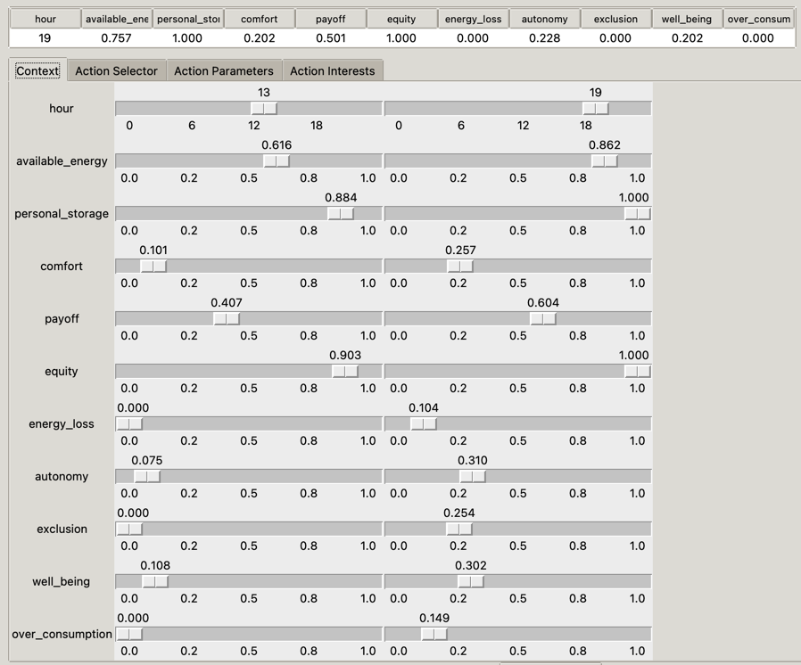
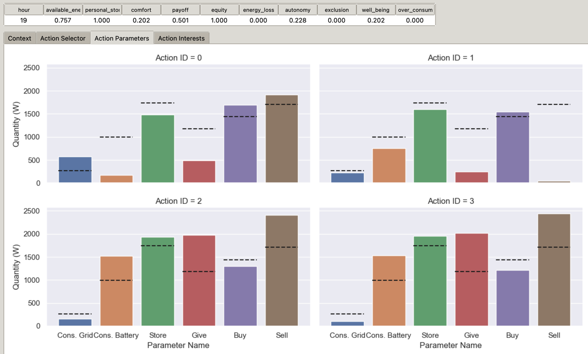
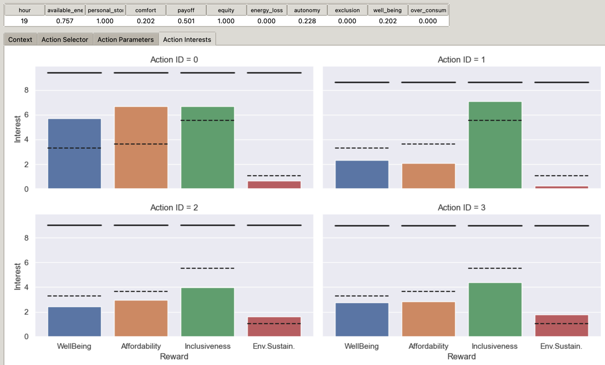

# Identifying and addressing dilemmas with contextualized user preferences {#dilemmas}

We present in this chapter the final and third contribution, which relates to the "dilemma management" part from the conceptual architecture in Figure \@ref(fig:conceptual-architecture).
Section \@ref(dilemmas-overview) begins with an overview of the contribution, explains what is missing in the previous contribution, and why it is necessary to focus on dilemmas.
Then, Sections \@ref(dilemmas-actions), \@ref(dilemmas-identifying), and \@ref(dilemmas-preferences) describe the 3 steps of our contribution.
These steps are summarized in Section \@ref(dilemmas-summary), along with two algorithms that formalize and recapitulate the operations performed in these steps.
The experimental setup is presented in Section \@ref(dilemmas-experiments), and the results reported in Section \@ref(dilemmas-results).
We finally discuss this contribution's benefits, limitations, and perspectives in \@ref(dilemmas-discussion).

## Overview {#dilemmas-overview}

In the previous chapters, we have first proposed reinforcement learning algorithms to learn behaviours aligned with moral values, and then a new way of constructing reward functions through symbolic reasoning by judging agents, with respect to several moral values.
However, the reward, as a scalar number, does not detail the agents' performances for each moral value.
This is due to the reinforcement learning algorithms themselves, which expect a scalar reward, and is true whether we consider the mathematical functions in Chapter \@ref(learning), such as *multi-objective sum*, or the symbolic-based judgments in Chapter \@ref(judgments), which were aggregated.
This is problematic, as it necessarily impoverishes the feedback sent to learning agents, and hides some details, such as conflicts between moral values.

Any aggregation function has some "collisions", i.e., different feedbacks that yield the same reward.
These collisions result in virtually no difference in the reward between two very different situations, with strong ethical significance.
The question of which feedbacks collide and result in the same reward depends on the aggregation function itself.
For example, using an average, $\texttt{average}\left(\left\{ 0.5, 0.5 \right\}\right) = \texttt{average}\left(\left\{ 1, 0 \right\}\right)$.
Similarly, using a min, $\texttt{min}\left(\left\{ 0.2, 0.2 \right\}\right) = \texttt{min}\left(\left\{ 0.2, 0.8 \right\}\right)$.
In these examples, the sets of numbers are feedbacks that represent specific rewards for two different moral values.
We can see that a first feedback with equal satisfaction (or defeat) of both moral values can have the same aggregated reward as another, very different feedback, where there is a significant difference between the moral values' rewards.
As we illustrate just below, such differences between feedbacks that can be obfuscated by aggregation can be very significant on the ethical point of view.
We may need to keep track of them and handle the tensions they reflect, with respect to moral values.

We recall that rewards are the signal that is used to learn the interests, or Q-Values, of actions in given states.
The interests, in turn, are used to select the most promising action in the current state.
Let us consider the following example: in a given situation, we have learned the interests of 3 different actions, which are all $0.5$.
The actions therefore seems comparable, and it would be as interesting to select the first as the second or third.
The agent may simply roll a die to choose one of them.
However, had we learned interests *per moral value*, instead of aggregated ones, perhaps we would have a completely different story.
The actions' vector interests could be, e.g., $\Q(s, a_1) = [0.5, 0.5]$, $\Q(s, a_2) = [1, 0]$, and $\Q(s, a_3) = [0, 1]$, indicating that the first action $a_1$ has the same, medium interest for both moral values.
On the contrary, the second action $a_2$ has a high interest for the first moral value, and a low interest for the second moral value, and $a_3$ mirrors $a_2$ with a low interest for the first moral value, and a high interest for the second.
Thus, there truly is an important choice to be made: do we want to satisfy all moral values equivalently?
Or do we prefer one of the moral values, at the expense of the other?
This decision should be made explicit, and deliberate, which is only possible if we have access to this knowledge.
In the aggregated scenario, we did not even know that there was a trade-off in the first place.

This question of a deliberate decision also opens up the subject of human preferences.
We have mentioned "do *we* want to satisfy all moral values equivalently?": in this sentence, the *we* should refer, we believe, to the human users' preferences.
Or, more specifically, to the agent's preferences, which should match the human ones.
As we mentioned in Chapters \@ref(introduction) and \@ref(positioning), the agents learn ethics according to an ethical intention that we, humans, inject in the system one way or another.
Up to now, this *ethical injection* was limited to a feedback upon actions compliance to given moral values.
We must now extend it to also include the ethical preferences over moral values, when a choice has to be made, because the agent does not know how to satisfy all moral values at once.

We argue that these preferences differ between users: we do not have the same priority order over moral values.
They also differ between contexts, where context refers to the current situation: we may not prioritize the same moral value in summer than in winter, for example, depending on our resistance to heat or cold, as well as the cost of heating or cooling, or the country's climate.
In this contribution, we thus propose to take into account this multi-objective aspect and to learn contextualized human preferences.
This is related to our third research question:

(ref:rq3)

To do so, we propose a Multi-Objective extension of the Q-SOM and Q-DSOM reinforcement learning algorithms, which we name *Q-(D)SOM-MORL*.
This extension follows 3 steps, each one addressing a different need.

1. The first step is to learn "interesting" actions in all situations, so that we can identify dilemmas and make an informed decision, or choice, when presented with a dilemma.
2. The second step is to correctly identify dilemmas. We propose definitions, inspired from the literature, and refine them to better suit our continuous domains case.
3. The third and final step is to learn the user preferences, based on the interesting actions from step 1, in the dilemmas identified at step 2. We refine the vague notion of "context" mentioned earlier, and describe what is a user preference, and how we can map them to the different contexts so that agents learn to settle dilemmas using the correct, expected preferences. Dilemmas in the same context are settled in the same way, so as to reduce the amount of required interactions with the human users.

Figure \@ref(fig:dilemmas-architecture) represents these 3 steps, and details the conceptual architecture proposed in Figure \@ref(fig:conceptual-architecture).
Learning agents, on the right side of the figure, still receive observations from the environment, and output actions to the environment.
However, their decision and learning algorithms now integrate additional data structures and processes, and learning agents are associated to a human user.

The *exploration profiles* focus on the 1st step, learning interesting actions, based on the observations of the current situation, and the multiple rewards received by the learning agent.
Note that, instead of aggregating them and receiving a single scalar $\in \RR$, as in the previous chapter, we now send directly all judgments from judging agents, and thus the learning agents obtain multi-objective rewards $\in \RR^m$, where $m$ is the number of objectives.
In our case, objectives correspond to the respect of moral values, and we thus equate "moral values" with "objectives" in this chapter.
The 2nd step aims at identifying whether the current situation is a dilemma, either known or unknown, by leveraging exploration profiles, and a *human profile* which is learned based on interactions with a human user.
Finally, the 3rd step selects an action: if the situation is not a dilemma, then the learning agent takes the best action; otherwise, it learns and re-uses the human contextualized preferences to settle the dilemma and choose an action, according to human preferences.

```{drawio dilemmas-architecture, src="figure/contribution3_dilemmas.drawio", out.width = "100%"}
#| fig.cap: >
#|   Architecture of the multi-objective contribution on the
#|   identification and settling of dilemmas by leveraging human contextualized
#|   preferences.
```

These 3 steps are detailed in the following sections.

## Learning interesting actions for informed decisions {#dilemmas-actions}

The shift from single-objective RL to multi-objective RL (MORL) brings several changes to the Q-(D)SOM algorithms presented in Chapter \@ref(learning).
Mainly, the interests, or Q-Values, become vectors instead of scalars, and some equations are no longer defined for this kind of input, especially for selecting and exploring actions.
In addition, as we want to leverage human preferences, we need to present a comparison measure for the different actions.
Specifically, 2 problems arise, which relate to the notion of "interesting actions":

1. How to correctly learn the actions' interests and select an action, compared to others, in the exploration-exploitation dilemma?
2. How to determine whether an action perturbed by a random noise, for exploration purpose, was interesting, with respect to previously learned action?

These 2 problems are detailed below; then, a solution involving the introduction of two distinct phases and *exploration profiles* is proposed and commented.

The first problem relates to the learning of actions in each situation, and more specifically of "interesting actions", which, in this case, means an action that is a suitable alternative as part of a dilemma.
This is necessary, as the ultimate goal is to make agents settle dilemmas, i.e., making a choice in a trade-off between interesting actions, based on human users' preferences.
To make this decision, both from the agents' and the humans' point of view, we need to know the actions' interests.
We also recall that a reinforcement learning algorithm learns interests as actions are tried in the environment.
Thus, during the learning, the interests at a given step might not reflect the "true" interests of the action.
For example, let us assume that we have an action $a_1$ with interests $\Q(s, a_1) = [0.8, 0.7]$.
This action seems pretty good with respect to both moral values.
Another action $a_2$ has other interests $\Q(s, a_2) = [1, 0.3]$.
This action seems better on the first objective, or moral value, but worse on the second objective.
We might think we are in a dilemma, as we have to choose between prioritizing the first objective, or the second, by selecting one of these 2 actions.
However, let us also consider that the first action was well explored, it was selected many times by the agent, and we are quite certain that the learned interests have converged very close to the true interests.
On the other hand, the second action was almost not explored, the agent only tried it once.
It might be possible that the received reward was a bit exceptional, due to some circumstances that do not often happen, and that, in fact, the true interests are closer to $[0.75, 0.3]$.
In such case, action $a_2$ would not be interesting, but rather *dominated*, in the Pareto sense, by $a_1$, as $\Q(s, a_1)$ would be strictly greater on each dimension.

This is what we mean by "interesting" actions in this first problem: to effectively compare them and determine whether there is a trade-off to be made, we need to have correctly learned their interests.
If the interests are not known, we risk considering an action as a potential candidate, whereas in fact it should not be, or conversely ignoring an actually good action.
In the previous example, perhaps $a_1$ in fact dominates $a_2$, or conversely $a_2$ is strictly better than $a_1$.
An action that is strictly dominated by another cannot be "interesting", as the other action would yield a better result for each moral value.
Asking users for their preferences in an uncertain case like this would only bother them.
Indeed, as the interests will be updated afterwards, it is unlikely the agent will have to retain the same preferences the next time it arrives in this situation.
We thus need to learn the interests of all actions, as close as possible to their true interests, before we can begin identifying and settling dilemmas, and asking users for their preferences.

The second problem that emerges when considering multiple objectives, is to answer whether the explored, randomly noised action is "interesting", i.e., yields better interests than its original action.
Indeed, we recall that, in the Q-SOM and Q-DSOM algorithms, in order to explore the actions space, a proposed action is first identified from the Q-Table.
The action's parameters are taken from the prototype vector of the associated neuron in the Action-(D)SOM.
Then, to explore and potentially find an even better action, a random noise is applied on these parameters.
The explored, or "perturbed" action, is thus enacted in the environment, and the agent receives an associated reward.
If this perturbed action was better than the proposed, learned action, the agent should update the Action-(D)SOM: to determine this, we used Equation \@ref(eq:interesting-proposed-action), that we recall below:

\begin{equation*}
  r_t + \gamma \max_{j'} \Q(s_{t+1},j') \stackrel{?}{>} \Q(s_t,j)
\end{equation*}

where $j$ is the index of the proposed action.
Basically, this equation means that if the received reward, and the maximum interest obtainable by taking an action in the new, resulting state, is higher than the learned interest of the proposed action, then the perturbed action is better than the proposed one, and the Action-(D)SOM should be updated towards the perturbed action.

However, this equation does not work any more in a multi-objective setting.
Indeed, we replaced the 2-dimensional Q-Table by a 3-dimensional table, where the 3rd dimension is the moral value.
In other words, we previously had $\Q(s,a) \in \RR$, but we now have $\Q(s,a) \in \RR^m$, and $\Q(s,a,k) \in \RR$, where $k$ is the moral value index $\in [[1,m]]$, with $m$ the number of moral values.
Similarly, the reward $r$ previously was $\in \RR$ but is now $\in \RR^m$.
The equation relied on taking the maximum interest and comparing 2 scalar values, which is trivial, but these relations are no longer defined in a vectorial space.

To solve these problems, we propose to change the Q-SOM and Q-DSOM algorithms, by introducing 2 distinct phases: a *bootstrap* phase, and a *deployment* phase.
In the bootstrap phase, agents are tasked with learning "interesting" actions, i.e., both the parameters that yield the best interests, and the true interests that correspond to these parameters, without focusing on dilemmas or user preferences.
These, on the other hand, are focused on during the deployment phase, where the agents leverage their knowledge of "interesting" actions to identify dilemmas and learn to settle dilemmas according to contextualized user preferences.

Concerning the first problem more specifically, we propose to change the action selection mechanism, and to prioritize exploration.
Indeed, since we now consider a bootstrap phase separated from the deployment, we do not need to maximize the expected sum of rewards during exploration.
We can instead focus solely on exploring and learning the actions' interests.
Taking inspiration from the Upper Confidence Bound method [@ucb], we memorize the number of times an action has been enacted, and we use this information as our new criterion.
A simple and intuitive way to then ensure that all actions are correctly learned, is to always select the action with the minimum number of times enacted.
Thus, at the end of the bootstrap phase, even if some actions have been less enacted, e.g., because the number of steps was not a multiple of the number of actions, we ensure that the "unfairness" is minimal.
We detail in Section \@ref(dilemmas-experiments) several specific methods that build upon $\min$ and compare them.

The second problem of determining whether a perturbed action is more interesting than the previously learned action can be solve by making the formula valid again.
One such way is to scalarize the vector components, but this would favour exploration in specific sub-zones of the action space.
For example, if we use an average aggregation, we would consider an action interesting, i.e., better than the learned one, only if the perturbed actions has higher interests on average, on all moral values.
If an action has a better reward on one specific moral value, but lower rewards on all other dimensions, it will not be learned.
This would prevent discovering some actions that can still be part of a trade-off.
To avoid this, during the bootstrap phase, we introduce the notion of *exploration profiles* to the learning agents.
Each exploration profile contains a vector of weights, which intuitively tells us which zone of the action space will be explored by this profile.
For example, the weights of an exploration profile might be $[0.9, 0.033, 0.033, 0.033]$, which will focus on actions that yield high interest on the first moral value.
To also discover actions that yield high interest on the second moral value, and so on, we create multiple exploration profiles, thus partitioning the action space between these profiles.

Additionally, as different exploration profiles will learn differently, notably updating their Action-(D)SOMs at various time steps, we also place the data structures in exploration profiles.

::: {.definition #dilemmas-exploration-profile name="Exploration profile"}
An exploration profile $p \in \mathbb{P}$ is defined as the following data structures and functions:

* State-(D)SOM: the "map" of situations to discrete states, which contains a fixed number of neurons, and thus of possible states. We define the set of possible states identifiers as $\DiscreteStates = [[0, \cdots, \length{\mathbf{U}}]]$, where $\length{\mathbf{U}}$ is the number of neurons.
  * $\StateFn_p : \ObsSpace \rightarrow \DiscreteStates$ is the function that returns a discrete state identifier for any observation vector, based on the profile $p$.
* Action-(D)SOM: the "map" of action identifiers to action parameters, which also contains a fixed number of neurons, and thus of possible actions. The set of possible action identifiers is $\DiscreteActions = [[0, \cdots, \length{\mathbf{W}}]]$, where $\length{\mathbf{W}}$ is the number of neurons. Each neuron is associated to a prototype vector, which is the action's parameters.
  * $\ActionFn_p : \DiscreteActions \rightarrow \ActionSpace_l$ is the function that returns the action's parameters for a learning agent $l$ from an action discrete identifier in profile $p$.
* Q-Table: the 3-dimensional table that learns and memorizes the interests of each (discrete) action identifier in each (discrete) state identifier. The interests are themselves a vector, indexed by the moral values.
  * $\Q_p : \DiscreteStates \times \DiscreteActions \rightarrow \RR^m$ is the function that returns these interests for an action $a$ in profile $p$, in a state $s$, where $m$ is the number of moral values.
* $\rho$ : the weights used to scalarize rewards and interests to determine whether a perturbed action is interesting, a vector $\in \RR^m$.
:::

We note that, contrary to existing approaches that use scalarization at some point, our exploration profiles are only used to explore, and never to choose an action.
This is a crucial difference; we want to use the human users preferences to select actions.
The exploration profiles are combined during the deployment phase so that agents have at their disposal all actions learned in the different sub-zones of the action space.
We note an exploration profile's vector of weights as $\rho$; the formula that determines whether a perturbed action is interesting thus becomes:

\begin{equation}
  \mathbf{r_t} \cdot \rho + \gamma \max_{j'} \left( \rho \cdot \Q(s_{t+1},j') \right) \stackrel{?}{>} \rho \cdot \Q(s_t,j)
  (\#eq:interesting-proposed-action-morl)
\end{equation}

where $\cdot$ denotes the dot product between 2 vectors, i.e., $\mathbf{x} \cdot \mathbf{y} = x_1 y_1 + x_2 y_2 + \cdots + x_n y_n$.

::: {.example name="Exploration profiles weights"}
Let us consider 4 moral values, as described in the Smart Grid use-case in Section \@ref(positioning-smartgrid-moral) and in the experiments of the previous chapter in Section \@ref(judgments-experiments).
We propose 5 different exploration profiles: 4 of them each focus on a different moral value, while the last one focuses on learning actions that yield interests "good on average".
The generalist exploration profile simply is set to $[\frac{1}{m}, \frac{1}{m}, \frac{1}{m}, \frac{1}{m}]$, where $m = 4$ is the number of moral values.
Thus, this profile considers all moral values equivalently.
For the other, specialized profiles, we propose to use a weight of $0.9$ for their specific moral value, and a weight of $\frac{0.1}{m-1} = 0.033$ for all other objectives.
For example, let us consider the previously learned interests $\Q(s,j) = [0.8, 0.3, 0.3, 0.3]$, and the received reward for the perturbed action $\mathbf{r} = [0.8, 0.4, 0.4, 0.4]$.
To simplify, let us ignore the $\max_{j'}$ part of the equation, and instead focus on comparing the reward with the previously learned interests.
The perturbed action thus did not manage to improve the interest on the first moral value, but did improve on the other objectives.
Had we used a weight of 0, we would ignore this improvement and determine that the perturbed action is not interesting, which would be counter-intuitive and counter-productive.
We use a very low weight on these other objectives, so that an eventual decrease on the targeted moral value cannot be compensated by an improvement on the other dimensions.
Other exploration profiles, such as $[0.75, 0.25, 0, 0]$ could also be used, and we detail in Section \@ref(dilemmas-discussion) perspectives on this topic.
:::

Note that, in addition, the Bellman equation must be adapted as well, where $k$ is used to iterate on the various moral values:

\begin{equation}
  \forall k \in [[1,m]] : \Q_{t+1}(s_t,a_t,k) \leftarrow \alpha \left[r_{t,k} + \gamma \max_{a',\rho} \Q_{t}(s_{t+1},a',k) \right] + (1 - \alpha)\Q_{t}(s_t,a_t,k)
  (\#eq:bellman-morl)
\end{equation}

The Q-Value was previously a scalar, updated by adding the reward, which was also a scalar; they are know both vectors.
We adapt the Equation \@ref(eq:bellman) presented earlier by simply using element-wise addition of vectors.
In other words, the first dimension of the Q-Value is updated by taking into account the first dimension of the reward, and so on.
We also need to obtain the interest of the next state, which was computed as the maximum Q-Value of any action in the next state $s_{t+1}$.
As we previously mentioned when adapting the "interesting criterion", the $max$ operator is not defined when comparing vectors: we thus propose to use the interests of the action that maximizes the dot product with the exploration weights $\rho$.

## Identifying dilemmas {#dilemmas-identifying}

Once the interesting actions have been learned, they can be leveraged to identify dilemma situations when the agent is deployed.
First, explorations profiles are merged into agents, and "frozen", i.e., their data structures, especially actions, are not learned any more.
When deployed, the learning agents will, at each step, compare the actions proposed by each exploration profile for the current situation, represented by the received observations from the environment.
To choose the action to execute, the agent first needs to determine whether there is a dilemma.
If there is, it cannot directly choose an action, and must rely on the human user's preferences; otherwise, there is no dilemma, thus the best action can be clearly defined, and the agent simply selects this action.

We pose a few definitions to formalize the dilemma identification process.
To better explain our reasoning behind the algorithm we propose, we start from a naïve application of an existing definition of dilemma, and point out the problems that arise and how we overcame them.
Let us recall that a situation is described by a vector of observations $\mathbf{o} \in \ObsSpace$, according to the DecPOMDP framework described in Definition \@ref(def:decpomdp).

We start by adapting a definition of *dilemma* proposed by @bonnemains2019formal:

> A situation is considered as a dilemma if there is at least two possible decisions, and every decision is unsatisfactory either by nature or by the consequences.

We refer the interested reader to Bonnemains' thesis for the formal definition.
However, Bonnemains used a symbolic model, whereas our actions are defined in terms of continuous interests and parameters.
Thus, we adapt it to better fit our conditions:

:::{.definition #dilemmas-naive-dilemma name="Naïve dilemma"}
A situation is considered as a dilemma if, among the proposed actions, all actions are unsatisfactory.
An action is unsatisfactory if there is another action with a higher interest on at least one dimension.
:::

This definition takes into account the fact that actions have continuous interests, and we always have a choice between at least 2 actions, provided that the number of neurons in the Action-(D)SOM is greater than or equal to 2, or that there are at least 2 exploration profiles.
It echoes the notion of *regret* also mentioned by Bonnemains.
For example, considering an action $a_1$ with interests $\Q(s, a_1) = [0.5, 0.5]$ and another action $a_2$ with interests $\Q(s, a_2) = [1, 0]$, we can say that taking action $a_1$ would result in a regret with respect to the first moral value, as $a_2$ would have yielded a better result.
Conversely, taking $a_2$ would result in a regret with respect to the second moral value, as $a_1$ would have yielded a better result.
Thus, for each of these actions, there is "another action with a higher interest on at least one dimension": if these are the only possible actions, the situation is a dilemma.

To formalize this definition, we note that it is in line with the notion of Pareto Front (PF), which is a well-known tool in multi-objective reinforcement learning.
We first define the Pareto-dominance operator:

\begin{equation}
  \mathbf{x} \gPareto \mathbf{y} \Leftrightarrow \left( \forall i : x_i \geq y_i \right) \text{and} \left( \exists j : x_j > y_j \right)
  (\#eq:pareto-dominance)
\end{equation}

In other words, a vector Pareto-dominates another if all its dimensions are at least equal, and there is at least one dimension on which the vector has a strictly superior value.
Applying it to our problem of identifying dilemmas, we can compute the Pareto Front (PF), which is the set of all actions which are not Pareto-dominated by another action:

\begin{equation}
  \PFFn(\mathbf{o}) = \left\{
      (p, a) \in (\Profiles, \DiscreteActions) \, | \, \nexists (p', a') \in (\Profiles, \DiscreteActions)
      \, \Q_{p'}(\StateFn_{p'}(\mathbf{o}), a') \gPareto \Q_p(\StateFn_p(\mathbf{o}), a) \right\}
  (\#eq:pareto-front)
\end{equation}

Note that we compare *all* actions from *all* profiles together to compute this Pareto Front (PF).
An action is unsatisfactory if there is another action with higher interests on at least one moral value: in other words, if it does not dominate all other actions.
Actions not in the PF are dominated by those in the PF and are unsatisfactory.
However, actions in the Pareto Front cannot dominate each other, by definition.
Thus, if the PF contains more than 1 action, it means that, for each action, there exists in the PF another action with a higher interest on at least one dimension, and thus the situation is a dilemma.

However, first experiments have demonstrated that this definition was not well-suited, because there was not a single situation with only 1 action in the PF.
This is due to 3 reasons:
1) As the interests are continuous, it is possible to have an action which is non-dominated by only a small margin, e.g., compare $[0.9, 0.9, 0.9, 0.9]$ to $[0.900001, 0, 0, 0]$. Clearly the first action seems better, nonetheless, because of the small difference on the first dimension, it does not dominate the second action.
2) We explore from different sub-zones of the action space, and we combine different exploration profiles which all search for different interests, e.g., one exploration profile tries to obtain actions with high interests on the first dimension, whereas another profile tries to obtain actions with high interests on the second dimension. Thus, it seems natural to obtain actions that cannot dominate each other.
3) We do not impose a limit on the number of moral values: we use 4 in our Smart Grid use-case, but we could theoretically implement dozens. To dominate another action, an action needs first and foremost to be at least equally high on all dimensions: if we increase the number of dimensions, the probability to find at least one dimension for which this is not the case will increase as well, thus preventing the second action to be dominated, and adding it to the PF.

Thus, the first and rather naive approach does not work in our case; we extend and improve this approach, by keeping the ideas of Pareto-dominating and Pareto Front, but adding new definitions and data structures, namely *ethical thresholds* and *theoretical interests*.
First, we build upon one of our general assumptions with respect to the Socio-Technical System: ethics comes from humans.
Thus, to determine whether an action is acceptable, from an ethical point of view, we choose to rely on the "source of truth" for ethics, i.e., the human users, and we introduce an *ethical threshold*, reflecting their judgment upon the point at which an action satisfies a given moral objective or value.
The ethical threshold is set by a human user for each learning agent, and is used as a target for the actions' interests.
Moreover, we note that learned actions' interests may be different between the various moral values.
This is partially due to the fact that some moral values may be harder to learn than others, or because of the way the reward function (or judgment) for this specific value is designed.
Human users may have different requirements for these moral values, for example someone who is not an ecologist might accept actions with a lower interest for the environmental sustainability value than the inclusiveness value.
For these 2 reasons, we choose to have a multi-objective ethical threshold: in other words, the thresholds for each moral value may differ.

::: {.definition #ethical-threshold name="Ethical threshold"}
An *ethical threshold* is a vector $\zeta \in \ThresholdSpace = [0,1]^m$, where $m$ is the number of moral values.
Each component $\mathbf{\zeta}_i$, $\forall i \in [[1,m]]$, can be read as a threshold between 0% and 100%, relative to the interest associated with moral value $i$.
:::

Note that we define the ethical thresholds as values between $0$ and $1$.
This is indeed, we argue, rather intuitive for the human users, and easy to understand: $0$ represents an action completely uninteresting, whereas $1$ represents an action perfectly interesting.
However, this poses a problem with the actual actions' interests: they are updated at each time step using the modified Bellman equation \@ref(eq:bellman-morl), which leaves them unbounded.
Interests depend both on the action's correctness, and the number of times they have been explored.
In other words, an action with a low interest could be explained either by its non-compliance with the moral values, or because it was not often explored.
For example, running a simulation for $5,000$ steps could yield an interest of $6$, whereas running the simulation for $10,000$ steps could yield an interest of $11$.
These absolute interests are not comparable, especially by lay users, as there is no reference: what does $6$ mean? Is it good?
We thus propose to introduce an anchor, or point of comparison, in the form of a *theoretical interest*.
The theoretical interests are computed using the same Bellman equation as the interests, with a small difference: we assume the received reward was the maximum possible, as if the action was "perfect".

Theoretical interests are updated at the same time as the interests, and thus grow similarly.
If the action is poorly judged, its interest will be lower than the theoretical interests; if the action is judged as adequate, its interests will converge close to the theoretical ones.
The number of steps impacts interests and theoretical interests exactly in the same manner: thus, the ratio between the two can be considered time-independent, e.g., if we train actions for only $5,000$ steps and get an effective interest of $6$, the theoretical interests will reflect the fact that the maximum will be near $7$.
Thus, an action with a ratio of $\frac{6}{7}$ can be considered as quite good.
On the other hand, if we train actions for $10,000$ steps but still get an effective interest of $6$, the maximum indicated by theoretical interests will be near $11$, and an action with a ratio of $\frac{6}{11}$ will be considered as less satisfactory.
We therefore offer a reference to compare unambiguously actions' interests that does not depend on the number of steps.
To compute and memorize the theoretical interests, we introduce a new data structure to the agents' exploration profiles in the bootstrap phase, which we name the *Q-theoretical table*.
As its name indicates, it is very similar to the Q-Table for interests; the only difference is the update equation, as we mentioned earlier.
In the sequel, we assume the maximum reward to be $1$, the equation for updating theoretical interests is thus:

\begin{equation}
  \Q_{t+1}^{theory}(s_t,a_t) \leftarrow \alpha \left[1 + \gamma \max_{a'} \Q_{t}^{theory}(s_{t+1},a') \right] + (1 - \alpha)\Q_{t}^{theory}(s_t,a_t)
  (\#eq:theoretical-bellman-update)
\end{equation}

Note that, to simplify, we did not consider the multi-objective aspect in this equation.
The actual formula adds a third dimension to the Q-theoretical table, but the update formula stays the same, as we use $1$ as the "theoretical reward", regardless of the moral value.

Now that we have the theoretical interests, and the ethical thresholds, we may define what is an *acceptable action*.

::: {.definition #acceptable-action name="Acceptable action"}
An action $(p,a) \in (\Profiles, \DiscreteActions)$, where $p$ is an exploration profile and $a$ an action identifier, is deemed *acceptable* if its interests, compared to the theoretical interests, in a given situation represented by the observations $\mathbf{o}$, attain the ethical thresholds on all moral values.
Formally, $(p,a)$ is acceptable if and only if $\forall i \in [[1,m]] : \frac{\Q_p(\StateFn_p(\mathbf{o}), a)_i}{\Q_p^{theory}(\StateFn_p(\mathbf{o}), a)_i} \geq \zeta_i$.
In this formula, $\Q_p$, $\StateFn_p$ are the functions from exploration profiles given in Definition \@ref(def:dilemmas-exploration-profile); $\Q_p^{theory}$ values are computed through Equation \@ref(eq:theoretical-bellman-update); $\zeta$ are the ethical thresholds as specified in Definition \@ref(def:ethical-threshold).
:::

We see that acceptable actions depend on the user-specified ethical thresholds; additionnally, as the theoretical interests are by construction superior or equal to the interests, the ratio is a value $\in [0,1]$ that can be easily compared with the thresholds.
Thus, an ethical threshold of $\zeta = [0.8, 0.75]$ might be read as: "An action is acceptable if its interest with respect to the first moral value is at least 80% of the maximum attainable, and its interest for the second moral value at least 75%".

From this, we can finally define a *dilemma*.

::: {.definition #dilemma name="Dilemma"}
A situation is said to be in a dilemma if none of the actions in the Pareto Front is *acceptable* with respect to a given ethical threshold.
More formally, we define a *dilemma* as a tuple $\left(\mathbf{o}, \zeta, \optimal \right) \in \left( \ObsSpace, \ThresholdSpace, 2^{\Profiles \times \DiscreteActions} \right)$, where $\mathbf{o}$ is the observation vector representing the situation, $\zeta$ is the user-given ethical threshold, and $\optimal$ is the Pareto Front of actions for the given situation, such that $\optimal = \PFFn(\mathbf{o})$ as defined in Equation \@ref(eq:pareto-front).
:::

This formal definition of *dilemmas* can be computed and used automatically by learning agents, while relying on human users' preferences for the ethical threshold.
An advantage is to offer configurability: some might consider that most actions are acceptable, thus letting agents choose in their place most of the time, whereas others might specify a higher threshold, thus identifying more situations as dilemmas and forcing agents to ask for their preferences concerning which action to take.
As the ethical thresholds are specified individually by user, several agents with various behaviours may coexist in the system.

## Learning user preferences {#dilemmas-preferences}

Once we know how to identify dilemmas, the next and final step mentioned in Section \@ref(dilemmas-overview) is to settle them, i.e., to choose an action.
This action cannot be the best, otherwise we would not be in a dilemma, and it reflects some trade-off between several, conflicting moral values.
We believe and defend that these trade-offs must be settled by human users, and we thus ask for their preferences.
However, asking for preferences adds mental charge to the humans: it is not a trivial task.
If we ask too often, it might become a burden, and the system becomes unusable: one of the goals of implementing a system of artificial agents is to automate some of our tasks, so as to relieve us; if the system asks us for the correct decision at each step, this completely negates the benefits.

To avoid this, we want to learn the human preferences, so that artificial agents will solicit humans less often, while still exhibiting a behaviour that corresponds to the human user's preferences.
Learning the correct preferences for dilemmas could be as simple as maintaining a map of dilemmas to preferences; yet, we recall that we are in continuous domains.
In particular, the situation in which a dilemma occurs is represented by an observation vector, which is composed of continuous values.
Thus, even a small difference in only one of the observation's components would yield, strictly speaking, a different dilemma.
This seems counter-intuitive: surely, not all dilemmas are unique?
We may consider that some conflicts in various situations correspond to similar dilemmas.
For instance, a choice of consumption at 2:00 AM or 2:01 AM can be considered close, and settled equivalently.
Yet, a choice between the same actions, with the same conflicts between moral values, may constitute a different dilemma when occuring at 7:00 AM, i.e., the choice may be different.
To reduce the burden on human users, agents could "group" dilemmas that are close; we thus need a way of grouping them.
To do so, we propose the notion of *context*, which we vaguely define, for now, as such:
"A context is a group of dilemmas identified as being similar, such that they can be settled in the same manner, i.e., with the same action selection".

We now need to propose a formal definition for these contexts, such that artificial agents can automatically identify them and group dilemmas by contexts.
This is what we first describe in this section.
Then, we explain how the unknown dilemmas are presented to human users to create new contexts when asking for their preferences, and how the preferences are learned.
As previously, we start with a naïve definition to highlight its issues, and explain the reasoning behind the actual definition.

First, we can notice that contexts are somewhat to dilemmas what discretized states are to observations.
A simple and intuitive idea can be to leverage the notion of states to define a context: if dilemmas appear in the same state, they may belong to the same context.
However, agents now use several exploration profiles when deployed, and each of the profiles has its own State-(D)SOM: in other words, each exploration profile discretizes observations into states differently, even though they receive the same observations vectors.
For example, profile $p_1$ might say that the current situation corresponds to state $s_3$, whereas profile $p_2$ might say it corresponds to $s_1$.
As we combine proposed actions from all exploration profiles, and proposed actions are determined from the Q-Table, based on the discrete state, we need to consider the states discretized by *all* exploration profiles, thus leading to a combination of states.
This combination of states effectively describe the current situation, for each exploration profile.
An unambiguous combination could be, e.g., $[s_3, s_1, s_{12}, s_{44}, s_5]$, where $s_3$ is the discrete state from profile $p_1$, $s_1$ from profile $p_2$, etc., with a total of 5 profiles.
Under this definition, another combination $[s_3, s_1, s_{12}, s_{44}, s_{22}]$ would be a different context, because one of the exploration profiles deemed the situation as a different state, even though all other states are the same.
Note that, if the discrete states are exactly the same for all exploration profiles, then we are guaranteed to have the same proposed actions, and thus the same Pareto Front of optimal actions.
Two dilemmas that have exactly the same combination of states would have the same proposed actions, which makes it easier to "settle them in the same manner", as our vague definition of context puts it.
Regardless of the action selection learned as a preference for this context, we are guaranteed to find the same action in both dilemmas.

<!--
We use `sloppy` to tell LaTeX it can increase the spacing between words,
so that the equation will flow to a new line, instead of overflowing into the margin
-->
`r if(knitr:::is_latex_output()) '\\sloppy'`
More formally, this definition of context can be represented as $\ContextFn(\mathbf{o}) =$ $\left\langle \forall p \in \Profiles \, | \, \StateFn_p(\mathbf{o}) \right\rangle$.
The 2 most important advantages are its simplicity to compute, and the guarantee that dilemmas in a same context have the same actions, as we mentioned.
However, earlier experiments have demonstrated a few flaws to this simple definition.
Indeed, with $5$ exploration profiles, and thus lists of $5$ elements, the probability that at least one of these elements differ is quite high, and increases with the number of possible discrete states, i.e., the number of neurons in the State-(D)SOM.
In one of our experiments, over $10,000$ steps and using $144$ neurons in the State-SOM, we obtained $1,826$ unique lists: there is still a $5 \times$ decrease factor, which is interesting for such a simple definition, but it is not enough.
Asking the users $1,826$ times in a simulation seems way too much in our opinion.
The main problem is that the vast majority of lists appear only a few times: 55% of time appear exactly 1 time, only 45% appear more than 2 times, 30% more than 3 times, 10% more than 10 times, etc.

Another attempt tried to leverage the AING [@bouguelia2013aing] algorithm to automatically group dilemmas through distance between situations they occur in, in the observation space.
AING is a clustering algorithm, based on the Growing Neural Gas idea [@fritzke1995growing]: each time step, a data point, i.e., a dilemma in our case, is presented to the neural gas.
The algorithm compares the point with the existing neurons: if it is sufficiently close to one of the neurons, according to an automatically determined threshold, the data point is associated with this neuron, and the neuron is updated slightly towards the data point.
If no neuron is sufficiently close, a new one is created at the exact position of the data point: this mechanism represents the creation of a new context in our case, when existing ones do not suffice to describe the current situation.
However, it failed to work, perhaps because dilemmas appear in a seemingly random order: we may have first a dilemma in the bottom-left quadrant, and then another in the upper-right quadrant, and so on.
Thus, the algorithm creates lots of neurons because all these dilemmas seem so far away from each other.
When finally a dilemma appears that seem close to another one, there are so many neurons around that the algorithm computes an infeasible distance threshold, and this dilemma is therefore also assigned to a new neuron.
We could have tweaked the distance formula to force the creation of fewer neurons, however, we feared that this may artificially create a topology that does not initially exist, and thus making our agents learn "garbage" contexts.
Another disadvantage is that neurons use a single distance threshold, relative to their center, which makes a sphere of attraction around their prototype.
However, we have no certainty that the bounds between any two different contexts can be represented by such spheres.
Perhaps, in some cases, we might have an abrupt bound, on a specific dimension, because at this specific point, there is a clear change of contexts for human users.
In other words, the same distance traveled does not have the same significance on two different dimensions.
A one-minute shift between 2:00 and 2:01 may not change the context, but a 1% shift in comfort between 49% and 50% could change the context, as seen by the user.

Reflecting on this, we thought that contexts exist in the human eye.
We thus propose to leverage human users to identify contexts, instead of a purely automated tool.
An additional advantage of this approach is that humans can bring their own baggage, and thus their own mental state, to the identification of contexts, which the artificial agents do not have access to.
More specifically, we define a *context* as a set of bounds, i.e., minimal and maximal values, for each dimension of the observation vector.
This is a quite simple definition that still allows for arbitrary bounds around the context.

An interface is created to allow human users to choose the bounds for each non-recognized dilemma, thus creating a new context.
When a dilemma is identified by a learning agent, the dilemma's situation is compared to the bounds of known contexts: if the situation is entirely inside the bounds of a given context, we say that this context "recognizes" the dilemma, and we apply the action that was learned for this context.
In other words, the dilemma belongs to the context.

::: {.definition #dilemmas-context name="Context"}
A *context* is a set of bounds, both minimal and maximal, for each dimension of the observation space $\ObsSpace_l$.
Formally, a context is defined as $c \in \Contexts = \left\langle \left(b_1, B_1\right), \cdots , \left(b_g, B_g\right) \right\rangle$, where $g$ is the number of dimensions of the observation space ($\ObsSpace_l \subseteq \RR^g$), $b_k$ is the lower bound for dimension $k$, and $B_k$ is the upper bound for dimension $k$.
A context *recognizes* a situation in a dilemma, represented by its observation vector $\mathbf{o_l}$ if and only if $\forall k \in [[1,g]] : b_k \leq o_{l,k} \leq B_k$.
:::

Now that we can define contexts, we can learn the users' preferences in each context about which action should be taken in dilemmas that are recognized by this context.
We also propose to filter actions by comparing their parameters and removing those with similar parameters, as they would have a similar effect on the environment.
This allows reducing the number of actions proposed to the user.
Indeed, because of the way we combine exploration profiles and the use of Pareto-domination, we end up with many proposed actions that do not dominate each other.
When simply merging the profiles together, and taking the Pareto Front of all proposed actions, we obtained most of the time between 4 and 16 optimal actions in the PF.
Although it might not be difficult to choose an action among 4, the cognitive load seems too high when we have to compare 16 actions.
For each pair of actions among the PF, if, for every dimension, their parameters differ by less than a given threshold, we consider the actions to be equivalent, and we only retain one of the two.
This threshold can be an absolute or relative value, and we detail in our experiments and results the choice of this threshold, and the resulting number of actions.
To give an order of magnitude, we managed to reduce from maximum 16-20 actions to about 4-6 actions each step, while using what seemed to us reasonable thresholds.

::: {.remark}
Let us emphasize that we only compare actions on their parameters.
Indeed, actions are sometimes similar on their interests as well; however, we argue it would not be a good idea to remove actions that have similar interests, if they have different parameters.
This is precisely what we want to avoid, by giving the control back to the user and asking them their preferences: to make the trade-offs explicit.
Using the interests is a great pre-filtering tool: if an action is clearly better than another, we do not want to keep the second one, as the first one was, in all likelihood, judged better with respect to the moral values, and thus would have a better impact.
This is why we use the interests to compute the Pareto Front.
Once we have the actions that cannot be compared to each other, because none of them dominates any other, i.e., the Pareto Front, we need to focus on the parameters instead.
If an action proposes to consume $600$Wh while another proposes to consume $590$Wh, the difference is perhaps not that important, and we can remove one of them.
On the contrary, if two actions have almost equal interests, but different parameters, this means there is a compromise to be made: although they would have a comparable impact in terms of rewards, by their very nature they are different.
:::

With the number of proposed actions reduced, and thus more manageable for lay users, we present these alternatives to the users when a dilemma occurs, and they accordingly define a new context.
The actions are compared both on their interests and their parameters, so that users may make an informed decision.
The association between contexts and chosen action, i.e., user's preferences, is simply memorized by an associative table.

## Summarizing the algorithm {#dilemmas-summary}

In this section, we summarize the 3 previous steps, which are formally described in 2 algorithms, one for the bootstrap phase, and another for the deployment phase:

1. Bootstrap phase (Algorithm \@ref(fig:dilemmas-bootstrap-algorithm)): learning interesting actions
2. Deployment phase (Algorithm \@ref(fig:dilemmas-deployment-algorithm))
   1. Identifying dilemmas in situations
   2. Learning contextualized user preferences

### Bootstrap phase

We recall that, in the first phase, we introduce new exploration profiles: each agent learns a separate profile.
Each exploration profiles contains a State-(D)SOM, an Action-(D)SOM, a Q-Table, and a new Q-theoretical table, which they learn throughout the time steps by receiving observations, selecting actions to explore them, and receiving rewards.
Algorithm \@ref(fig:dilemmas-bootstrap-algorithm) describes the process that takes place during the bootstrap phase, although in a pseudo-algorithm manner, where some functions such as the random perturbation (noise) over actions are left out or the update of (D)SOMs, as they have been previously described in Chapter \@ref(learning).

The bootstrap phase is set for a fixed number $T$ of steps (line 1).
At each time step $t$, learning agents receive observations (line 4), and determine the state hypothesis as in the Q-SOM and Q-DSOM algorithms (line 5), by leveraging the State-SOM and finding the Best Matching Unit.
They select actions based on the number of times they were already chosen (lines 6 and 7), and noise the action parameters to explore the action space (line 8).
The selected action is then executed in the environment (line 9).
Learning agents receive the new observations and the reward (lines 12 and 13), and use them to update their data structures (State-(D)SOM, Action-(D)SOM, Q-Tables), similarly to the Q-SOM and Q-DSOM algorithms (lines 14-21).
However, this updated algorithm differs on 2 aspects:

1) The perturbed action is deemed interesting or not based on the exploration profile's weights and Equation \@ref(eq:interesting-proposed-action-morl) (line 16).

2) In addition to the Q-Values, which are updated using Equation \@ref(eq:bellman-morl), the Q-theoretical values are updated thanks to Equation \@ref(eq:theoretical-bellman-update) (line 20).

```{algorithm dilemmas-bootstrap-algorithm, fig.cap = "Learning process during the bootstrap phase", fig.pos = "!ht"}
\newcommand\mycommfont[1]{\footnotesize\ttfamily\textcolor{gray}{#1}}
\SetCommentSty{mycommfont}
\DontPrintSemicolon
\SetAlgoLined

\SetKwFunction{FnBootstrap}{learning}
\SetKwProg{Fn}{Function}{:}{end}

\Fn{\FnBootstrap{}}{
  \KwData{\\
    $\quad \LAgts$ the set of learning agents\\
    $\quad T$ the number of time steps\\
    $\quad N_{l,s,j}$ the number of times action $j$ was selected in a state $s$\\
    $\quad \rho$ the agent's exploration profile
    $\quad \mathcal{U}, \mathcal{W}$ State-(D)SOM and Action-(D)SOM neurons\\
    $\quad \mathbf{U_i}, \mathbf{W_j}$ vector associated to neuron $i$ (resp. $j$) of the State-(D)SOM (resp. Action-(D)SOM)\\
  }

  \For{$t = 1$ to $T$}{
    \tcc{All agents choose an action to explore}
    \For{$l \in \LAgts$}{
      $\mathbf{o_{l,t}} \gets \texttt{observe}(env, t, l)$\;
      \tcc{Discretize state}
      $s_t \gets \argmin_{i} || \mathbf{o_{l,t}} - \mathbf{U_{i}} ||$\;
      \tcc{Choose action based on number of times enacted instead of interests}
      $j \gets \texttt{choose}(\mathbf{N_{l,s}})$\;
      $N_{l,s,j} \gets N_{l,s,j} + 1$\;
      \tcc{Random noise to explore the action space}
      $\mathbf{a_{l,t}} \gets \texttt{noise}(\mathbf{W_j})$\;
      $\texttt{execute}(env, \mathbf{a_{l,t}})$\;
    }
    \tcc{Agents learn and update their data structures}
    \For{$l \in \LAgts$}{
      $\mathbf{o_{l,t+1}} \gets \texttt{observe}(env, t+1, l)$\;
      $\mathbf{r_{l,t}} \gets \texttt{reward}(env, t+1, l)$\;
      \tcc{Compute neighborhood of the (D)SOMs}
      $\psi_{U} \gets \texttt{neighborhood}(\mathcal{U}, s, \mathbf{o_{l,t}})$\;
      $\psi_{W} \gets \texttt{neighborhood}(\mathcal{W}, j, \mathbf{a_{l,t}})$\;
      \tcc{If the noised action is interesting}
      \If{$\mathbf{r_t} \cdot \rho + \gamma \max_{j'} \left( \rho \cdot \Q(s',j') \right) > \rho \cdot \Q(s,j)$}{
        Update the Action-(D)SOM using $\psi_{W}$\;
      }
      \tcc{Update Q-table and Q-theoretical}
      $\forall u \in \mathcal{U} \; \forall w \in \mathcal{W} \quad \Q(u,w) \gets \alpha_{Q}\psi_{U}(u)\psi_{W}(w)\left[r + \gamma \max_{j'}\left(\Q(i',j')\right) - \Q(u,w)\right] + \Q(u,w)$\;
      $\forall u \in \mathcal{U} \; \forall w \in \mathcal{W} \quad \Q^{theory}(u,w) \gets \alpha_{Q}\psi_{U}(u)\psi_{W}(w)\left[r + \gamma \max_{j'}\left(\Q^{theory}(i',j')\right) - \Q^{theory}(u,w)\right] + \Q^{theory}(u,w)$\;
      Update the State-(D)SOM using $\psi_{U}$\;
    }
  }
}
```

`r if(knitr:::is_latex_output()) '\\clearpage'`

### Deployment phase

On the other hand, Algorithm \@ref(fig:dilemmas-deployment-algorithm) describes the process in the deployment phase.
Note that the algorithm considers a fixed number of time steps $T$ (line 2), but in practice, nothing prevents from setting $T = \infty$.
At each time step, learning agents receive observations (line 3).
To select an action, agents compute the Pareto Front (PF) of optimal actions (line 4), as described in Equation \@ref(eq:pareto-front).
They then determine whether each of them is an acceptable action, according to Definition \@ref(def:acceptable-action), leveraging the ethical thresholds $\zeta$ set by the human user (line 5).
If at least 1 acceptable action can be found, the situation is not a dilemma, and the agent automatically selects one of the acceptable actions (lines 7-9).
We propose to choose based on the sum of interests per action, so that the selected action has the best impact on the environment (line 8).
Otherwise, if no acceptable action can be found, the situation is a dilemma (lines 10-26), and the agent looks for a context that would recognize this dilemma, as defined in Definition \@ref(def:dilemmas-context).
This means that, for each context, and for each dimension $k$ of the observation space, we check whether the observation $o_{l,t,k}$ is within the bounds $c_{[b_k]}$ and $c_{[B_k]}$ defined by the context (line 13).
When such a context is found, the action that was associated to this context by the user is selected.
In the case where no context corresponds (lines 18-24), an interface asks the user for which action to be enacted, and the definition of a context in which the same action should be selected again.
We filter the proposed actions to remove those which have too similar parameters (lines 20-21): if another action is found with parameters differing by less than 3% on each dimension, the action is removed from the set of proposed actions.
For example, $\left[1, 1, 1, 1, 1, 1\right]$ and $\left[0.99, 0.98, 0.99, 0.99, 0.99, 1\right]$ have less than 3% difference on each dimension, and thus one of them will be removed.
Finally, the association of this context to the selected action is memorized (line 23), so that it may be re-used in future time steps.
The selected action (whether from an existing or a new context) is executed in the environment (line 25).

`r if(knitr:::is_latex_output()) '\\clearpage'`

```{algorithm dilemmas-deployment-algorithm, fig.cap = "Decision process during the deployment phase", fig.pos = "H"}
\newcommand\mycommfont[1]{\footnotesize\ttfamily\textcolor{gray}{#1}}
\SetCommentSty{mycommfont}
\DontPrintSemicolon
\SetAlgoLined

% The following commands are necessary to break lines ...
%\newcommand{\nosemic}{\renewcommand{\@endalgocfline}{\relax}}% Drop semi-colon ;
%\newcommand{\dosemic}{\renewcommand{\@endalgocfline}{\algocf@endline}}% Reinstate semi-colon ;
\newcommand{\pushline}{\Indp}% Indent
\newcommand{\popline}{\Indm}% Undent

\SetKwFunction{FnDeployment}{decision}
\SetKwProg{Fn}{Function}{:}{end}

\Fn{\FnDeployment{}}{
  \KwData{\\
    $\quad \LAgts$ the set of learning agents\\
    $\quad T$ the number of time steps\\
    $\quad \mathit{Contexts}_l$ the map of contexts to action learned by agent $l$\\
  }

  \For{$t = 1$ to $T$}{
    \tcc{All agents choose an action}
    \For{$l \in \LAgts$}{
      $\mathbf{o_{l,t}} \gets \texttt{observe}(env, t, l)$\;
      \tcc{Get optimal actions from the profiles}
      $\optimal \gets \PFFn(\mathbf{o_{l,t}})$\;
      \tcc{Filter eventual acceptable actions}
      $\mathit{acceptables} \gets \left\{ (p,a) \in \optimal \mid \forall i \in [[1,m]] : \frac{\Q_p(\StateFn_p(\mathbf{o_{l,t}}), a)_i}{\Q_p^{theory}(\StateFn_p(\mathbf{o_{l,t}}), a)_i} \geq \zeta_i \right\}$\;
      \If{$\length{\mathit{acceptables}} \geq 1$}{
        \tcc{Not a dilemma, let us take the acceptable action with maximum sum of interests}
        $\mathbf{a} \gets \max_{\sum} (\mathit{acceptables})$\;
      }
      \Else{
        \tcc{This is a dilemma, try to find an existing suitable context}
        $\mathit{context} \gets \mathit{null}$\;
        \ForAll{$(c,\mathbf{a}) \in \mathit{Contexts}_l$}{
          \If{$\forall k \in [[1,g]] : c_{[b_k]} \leq o_{l,t,k} \leq c_{[B_k]}$}{
            \tcc{Context $c$ recognizes the current situation}
            $\mathit{context} \gets c$\;
            break\;
          }
        }
        \If{$\mathit{context} == null$}{
          \tcc{No context has been found, ask the user}
          %\tcc{Ask the context's bounds from the user}
          $\mathit{context} \gets \texttt{ask\_bounds}(\mathbf{o_{l,t}})$\;
          \tcc{Remove actions which have parameters closer than 3\% on each dimension}
          % The following equation is too long, we need to break the line. It involves \pushline, \popline (see above).
          $\optimal \gets \{ (p, a) \in \optimal \mid \nexists (p', a') \in \optimal :$\;
            \pushline $\forall k \in [[1,d]] \left| \ActionFn_p(a)_k - \ActionFn_{p'}(a')_k \right| \leq 0.03 \times \left| \ActionFn_{p'}(a')_k \right| \}$\;
          \popline %\tcc{Ask the desired action from the user}
          $\mathbf{a} \gets \texttt{ask\_action}(\optimal)$\;
          \tcc{Memorize this couple context and selected action}
          $\mathit{Contexts}_{l,\mathit{context}} \gets \mathbf{a}$\;
        }
        $\texttt{execute}(env, \mathbf{a})$\;
      }
    }
  }
}
```

`r if(knitr:::is_latex_output()) '\\clearpage'`

## Experiments {#dilemmas-experiments}

In this section, we describe the experiments' setup we used to evaluate our contribution on the multi-objective aspect, with a focus on learning interesting actions and identifying dilemmas to, ultimately, learn the contextualized users' preferences in dilemmas.
These experiments are split into 2 sets: the bootstrap phase, and the deployment phase.
Note that the latter leverages the data structures, i.e., exploration profiles, learned from the former.
The implementation details for some mechanisms, such as the action exploration selection during the bootstrap, which were left out in previous sections, are also detailed and compared here.

The implementation was done in the Python 3 language, so that it could be integrated easily with the Q-(D)SOM algorithms.
The Graphical User Interface (GUI) used to interact with users was developed using the Tkinter library, and Ttk (Themed Tk) widgets, as it is a simple library for creating GUIs.
Tkinter also has the advantages of being part of standard Python, available on most platforms (Unix, macOS, Windows), and capable of easily integrating Matplotlib plots, which are used to present actions' interests graphically.

The rewards came from argumentation-based judging agents (AJAR) as described in Section \@ref(judgments-experiments-ajar), using the "min" aggregation and the "simple" judgment function.
They were slightly modified to avoid aggregating the reward and instead sending the vector to the RL algorithms.

### Learning profiles from bootstrapping

We recall that the objective of the bootstrap phase is to learn interesting actions, in all situations.
To do so, we introduced exploration profiles that include a weight vector for scalarizing rewards and interests, so as to focus on different sub-zones of the action space.
Agents need to explore the actions so that they can be compared fairly: they do not yet need to exploit at this point, as the bootstrap phase is separated from the deployment phase.
Thus, the action selection mechanism has been modified with a focus on the number of times they have been selected, instead of their interests.

#### Action selection

Initially, we chose to simply select actions randomly: according to the law of large numbers, every action having the same probability of being drawn, they should all be drawn a similar number of times as the number of draws increase.
This simple method also avoids memorizing the number of times each action is selected in each state, which saves computational resources, especially memory.
However, first experiments have shown empirically that, in some states, the distribution of actions' selection was not uniform.
States that were more visited had higher standard deviations of the number of times each action was chosen.
This is a problem, as we want the actions' interests to be fairly comparable, so that they can be shown to users later, and they can make an informed choice.
Whereas it was part of the exploitation-exploration dilemma in the Q-(D)SOM algorithms, we now want the actions to be fairly compared by having been selected, and thus explored, roughly the same number of times.
To reduce the standard deviation of actions' selection within states, and thus achieve fairer comparisons, a first improvement was to replace the random method with a min method, by memorizing $N_{l,s,a}$ the number of times an agent $l$ has chosen action $a$ in state $s$, and by always choosing the action with the minimum $N_{l,s,a}$.

This method indeed managed to reduce the disparities, within a state.
There was still a disparity between states, because some states are more rarely visited than other, but this stems from the environment dynamics, on which we cannot act.
Within a given state, all actions were chosen exactly the same number of times, with a margin of $\pm 1$.
Indeed, if a state is visited a total number of times that is not a multiple of the number of actions, it is impossible to select every action the same number of times.
Yet, by construction, the min method does not allow the difference to be higher than $1$: if all actions but one have been selected $x$ times, and the last one $x-1$, min will necessarily choose this one.
At the next step, all actions have therefore been selected $x$ times, any of them can be chosen, thus resulting in one action selected $x+1$ times and all other $x$ times.
If this state is never visited any more after that, we cannot compensate this difference and end up with a margin of $1$ between actions.
We computed the standard deviation for each state, and then compared a few statistics: when using the random method, standard deviations ranged from $0.7$ to $6.6$, with an average of $2.4$, whereas, when using the min method, they ranged from $0$ to $0.5$, with an average of $0.4$.

The min method thus offers more theoretical guarantees than the random method, at the expense of higher computational needs.
However, there is still a slight bias in this method, due to an implementation detail of the $\texttt{argmin}$ method that returns the action $a$ with the lowest $N_{l,s,a}$: when multiple actions are candidates, i.e., have the same lowest $N_{l,s,a}$, $\texttt{argmin}$ returns the first one.
Thus, the order of action selection will always be $a_1, a_2, a_3, a_1, a_2, a_3, \cdots$ for 3 actions in a given state.
If the state is not visited a number of steps that is a multiple of the number of actions, the first actions will be advantaged compared to the others, e.g., $a_1, a_2, a_3, a_1$.
This is only a small bias, as the difference will only be $1$ in the worst case, but still, we can wonder why choosing always the first actions, perhaps other ones would be better.
We propose to use the "min+random" method, which consists in taking a random action among those which have the lowest $N_{l,s,a}$ only.
It has, again by construction, the same guarantees as the min method, but is not biased towards the first actions.


#### Agents and exploration profiles

As mentioned in the previous sections, we propose to use a "generalist" profile granting equal importance to all moral values, and several "specialized" profiles that focuses on the compliance with a particular moral value.
Concretely, the weights vector for each profile are:

- $\rho_1 = \left[ 0.25, 0.25, 0.25, 0.25 \right]$
- $\rho_2 = \left[ 0.9, 0.033, 0.033, 0.033 \right]$
- $\rho_3 = \left[ 0.033, 0.9, 0.033, 0.033 \right]$
- $\rho_4 = \left[ 0.033, 0.033, 0.9, 0.033 \right]$
- $\rho_5 = \left[ 0.033, 0.033, 0.033, 0.9 \right]$

Each of these exploration profiles is learned by a separate learning agent.
In addition, as the agents' learned actions will be used in a deployment phase, where many agents will impact the same environment, we added several other learning agents, that do not learn exploration profiles but rather try to optimize their behaviour as previously, using the Q-SOM algorithm.
Thus, the exploration profiles are learned in a quite realistic scenario.

We ran 1 simulation using the *annual* consumption profile, with our 5 "exploration profile" agents, and 26 other agents (20 Households, 5 Offices, 1 School).
At the end of the simulation, the exploration profiles were exported to be reused later, and particularly in the deployed experiments.

### Deployment phase

Once the exploration profiles were learned, we created new agents that contained the 5 previously learned exploration profiles, instead of having a State-(D)SOM, an Action-(D)SOM.
There are 2 goals for the experiments of this phase:

1. Show a proof-of-concept interface that is usable by human users to learn the contexts and preferences.
2. Demonstrate that agents learn behaviours that are aligned with the given preferences over moral values.

#### User interaction through a graphical interface

In order to allow users to interact with the learning agents, we created a prototype Graphical User Interface (GUI), which is used when the agent detects a dilemma in an unknown (new) context.
We recall that, from the presented algorithm, the agent asks the user for the solution of the dilemma, i.e., which action should be chosen, and the definition of a context in which other dilemmas will be considered similar, i.e., the lower and upper bounds.

The GUI thus presents the current situation, and a set of sliders so that the user can set up the lower and upper bounds, for each dimension of the observation space.
This is depicted in Figure \@ref(fig:dilemmas-context-gui).

```{r dilemmas-context-gui, out.width = "100%"}
#| fig.cap: >
#|   The graphical interface used to create a new context. The current
#|   situation, represented by an observation vector's values, is shown at the
#|   top. The bottom part contains sliders that the user must set up to define
#|   the desired bounds.

```

::: {.remark}
Note that the environment simulator and the learning algorithms manipulate vectors of values $\in [0,1]^g$.
This is indeed easier to learn representations: if a dimension shows higher absolute values than others, it might become (falsely) preponderant in the decision process.
Having all dimensions in $[0,1]$ mitigates this.
However, human users do not have this requirement; on contrary, it is sometimes more difficult to understand what such a value means, e.g., for the time (hour).
We understand immediately what 3 o'clock means, but $\frac{3}{24} = 0.125$ is not immediate.
Thus, we transformed the value of the "hour" dimension to use a 24-hour format rather than the machine-oriented $[0,1]$ format.
Similar transformations could be applied to other dimensions as well, by injecting a priori knowledge from the designers.
:::

The user must select both the context bounds and the action that should be taken when this context is identified, in any order.
The bounds' tab is initially shown, but the user may change the tab freely.
We note that it may also be interesting to first ask the user the dilemma's solution before asking for the bounds, as the conflicts between values and actions might guide its ethical reasoning.
To do so, the interface presents the different available alternatives, i.e., the optimal actions inside the Pareto Front (PF), after filtering the actions that are too close in parameters.
To describe the actions, we choose to plot all actions' respective parameters on the same plot, as several histograms, such that users can compare them quickly.
To improve the visualization, we also compute and plot the mean of each parameter for the proposed actions: this allows distinguishing and comparing actions.
Figure \@ref(fig:dilemmas-actions-parameters-gui) gives an example of these plots.
The first two actions, ID = 0 and ID = 1, can be compared, e.g., as follows: "action #0 proposes to consume from the grid twice as energy as the mean of proposed actions; action #1 on the contrary, consumes from the grid less than the average".

```{r dilemmas-actions-parameters-gui, out.width = "100%"}
#| fig.cap: >
#|   Interface to compare actions by their respective parameters. The dashed
#|   line represents the mean, for each parameter, of the proposed alternatives.

```

Similarly, we also plot and compare the actions' respective interests, in a separate tab.
These interests correspond to the expected satisfaction of each moral value, for every proposed action.
As for the parameters, we show the mean on each dimension to facilitate comparison, and, in addition, we also show the theoretical maximum interest.
Figure \@ref(fig:dilemmas-actions-interests-gui) shows an example of this interface.

```{r dilemmas-actions-interests-gui, out.width = "100%"}
#| fig.cap: >
#|    Interface to compare actions by their respective interests. The dashed
#|    line represents the mean, for each interest, of the proposed alternatives.
#|    The thick black line represents the theoretical maximum for this specific
#|    action on the specific interest.

```

As we did not have time nor resources for making an experiment with a panel of lay users, I made a single experiment, placing myself as a user of the system.
Thus, the experiment is somewhat limited, with only 1 single agent, and we cannot determine how usable the interface is for non-expert users; however, this experiment still proves the ability to interact with agents, and how agents can learn the contexts.
One important aspect is the number of identified contexts, as we do not want the interface to be overwhelming to users.
If agents ask their users every 2 steps, the system would quickly be deemed unusable.
We expect the agents to quickly identify dilemmas that they cannot settle, as they have initially no knowledge of the preferences, and to reduce the number of required interactions as the time steps increase, because more and more dilemmas will be associated with a known context.

#### Learning behaviours aligned with contextualized preferences

The second goal of these simulations is to demonstrate that the learned behaviours are aligned with the preferences.
For example, if a human user prefers ecology, represented by the *environmental sustainability* value, the agent should favour actions with high interests for this value, when in an identified dilemma.
Again, we did not have resources for making experiments with a sufficient number of users.
Thus, we propose a proxy experiment, by implementing a few synthetic profiles that are hardcoded to make a decision in a dilemma by using simple rules.
We make a proof-of-concept experiment and do not assume that such profiles accurately represent the diversity of human preferences in our society, but we make the hypothesis that, if the system correctly learns behaviours that correspond to these hardcoded preferences, it will learn appropriate behaviours when in interaction with real human users.

We propose the following profiles:

* The "Flexible ecologist" represents humans who want to support the *environmental sustainability* value, as long as their comfort is above a certain threshold. In other words, they filter the actions for which the *well-being* interest is above the threshold, and take the one that maximizes the *environmental sustainability* interest among them. However, if no such action is proposed, then they resort to maximizing their comfort through the *well-being* interest.
* The "Activist ecologist" is the contrary of the "flexible" one. As long as there are actions for which the *environmental sustainability* is above an acceptable threshold, they take the action in this sub-group that maximizes their comfort through the *well-being* interest. When no action satisfies this threshold, they sacrifice their comfort and take the action that maximizes *environmental sustainability*.
* The "Contextualized budget" focuses on the notion of *contextualized* preferences, and makes different choices based on the context, i.e., the current situation. When a dilemma is identified during the day, this profile chooses the action that avoids paying too much, by favouring the *affordability* value. On contrary, when a dilemma is identified during the night, the profile chooses to improve its comfort by maximizing the *well-being* value. This example echoes some contracts where the energy price is time-dependent (peak/off-peak hours), and where the price is usually cheaper at night.

## Results {#dilemmas-results}

In this section, we present the results for the experiments described above.

### Learning profiles

We first show the learned interests, from all profiles, relatively to their theoretical interests, i.e., the interests actions they propose would have if they received the maximum reward $1$ at each time step, on all moral values.
The closer an action is to the theoretical interests, the better its impact on the environment, as judged by the reward function.
Figure \@ref(fig:dilemmas-results-learning-interests) shows the ratios of interests over theoretical interests.

```{python dilemmas-results-learning-interests, out.width = "80%"}
#| fig.cap: >
#|   Ratio between learned interests and theoretical interests, for all actions
#|   in all states, from all exploration profiles.
import pandas as pd
import matplotlib.pyplot as plt
import seaborn as sns
sns.set()

df = pd.read_csv('data/contribution3/learning_profiles_all_interests.csv')
df['Ratio'] = df['Interest'] / df['Theoretical']

g = sns.catplot(data=df,
                kind='violin',
                x='Objective',
                y='Ratio',
                hue='Objective')
for ax in g.axes.flatten():
    ax.set_xticklabels(ax.get_xticklabels(), horizontalalignment='center')
    ax.set_yticks([0.0, 0.1, 0.2, 0.3, 0.4, 0.5, 0.6, 0.7, 0.8, 0.9, 1.0])
    ax.set_yticklabels(['0%', '10%', '20%', '30%', '40%', '50%', '60%', '70%', '80%', '90%', '100%'])
plt.tight_layout()
plt.show()
```

From this figure, we note two important results.
First, actions manage to attain high interests, w.r.t. the theoretical ones, on all moral values, although some can be more difficult to satisfy than others, particularly the *environmental sustainability* in our case.
Thus, we demonstrate that the proposed algorithm, during the new *bootstrap* phase, can learn "interesting" actions, which was one of our goals for the experiments.
Yet, we see that the satisfaction of moral values are not learned equivalently.
The second point is that, in order to select the ethical thresholds, having prior and expert knowledge about the learned interests might be an advantage.
Providing human users with this knowledge could help them to choose appropriate ethical thresholds.
On the other hand, a potential risk is that it would encourage users to lower their expectations too much, and reduce the desirable to the automatable, by settling for what the machine can do.

As we mentioned in the previous sections, it is important that actions are selected a similar number of times, to ensure a fair comparison, before presenting the alternatives to human users.
Otherwise, we would risk proposing two actions that are in fact incomparable, because one of them has higher uncertainty over its interests.
We thus memorized the number of times each action was selected, in each state: Figure \@ref(fig:dilemmas-results-learning-enacted) shows the results.

```{python dilemmas-results-learning-enacted, out.width = "70%"}
#| fig.cap: >
#|   Number of times each action was selected in each state.
import pandas as pd
import matplotlib.pyplot as plt
import seaborn as sns
sns.set()

df = pd.read_csv('data/contribution3/learning_profiles_nb_enacted.csv')
df = df.pivot_table(values='NbEnacted', index='State', columns='Action')

g = sns.heatmap(data=df, cmap='flare')
plt.show()
```

In this figure, each state of the State-(D)SOM is represented as a row, whereas each action of the Action-(D)SOM is represented as a column.
The color indicates the number of times an action was selected in a given state.
We remark from the figure that, although rows have various colors, each line is, individually, roughly uniform.
For example, the first row, i.e., state #0, is entirely purple, there is no red, orange, or yellow that would indicate an action less often selected.
This demonstrates that our proposed action selection mechanism effectively explores actions similarly, without focusing too much on one specific action within a given state.
Thus, we can, when in a dilemma, compare the actions' interests fairly, as we know they were given the same chances.

To verify this mathematically, in addition to visually, we computed the standard deviation of the number of times the actions were enacted, within each state.
Figure \@ref(fig:dilemmas-results-learning-enacted-std) shows the distribution of the found standard deviations, for every state.
As we can see, the vast majority of states have a low deviation, which means actions were explored similarly.

```{python dilemmas-results-learning-enacted-std, out.width = "70%"}
#| fig.cap: >
#|   Distribution of the standard deviations of actions' number of times
#|   selected, for each state. The curve represents a kernel density estimation.
import pandas as pd
import matplotlib.pyplot as plt
import seaborn as sns
sns.set()

df = pd.read_csv('data/contribution3/learning_profiles_nb_enacted.csv')
df = df.pivot_table(values='NbEnacted', index='State', columns='Action')
df = df.std(axis=1)  # axis=1 because we want a std for every state

g = sns.histplot(data=df, kde=True)
g.axes.set_xlabel('Standard Deviation')
g.axes.set_ylabel('Number of states')
# plt.tight_layout()
# plt.legend(bbox_to_anchor=(1,1), loc='center left')
plt.show()
```

### Learning human preferences

As mentioned previously, in this experiment I placed myself as the human user of a learning agent, and settled dilemmas that were presented to me through the prototype interface.
Our hypothesis was that the agent would, initially, identify many dilemmas, as it had not learned yet my preferences; as the time steps goes by, most identified dilemmas should fall within one or another of the already known contexts, and the number of interactions should decrease.
To verify this, we have, during the experiment, memorized each dilemma the agent encountered, and the time steps at which each context was created.
The contexts also memorize which dilemmas they "recognize", i.e., the dilemmas that correspond to this context and are automatically settled by the agent.
After the experiment, we computed the total number of identified dilemmas the agent encountered: knowing at which time step a context is created, and how many situations it recognized during the simulation, we can plot the number of "remaining" dilemmas to be settled.
Figure \@ref(fig:dilemmas-results-human-nb-remaining) shows this curve: we can see that, at the beginning of the simulations, we have still $10,000$ dilemmas to settle.

At the first step, a first dilemma is identified: this is natural, as the agent does not know anything about my preferences at this point.
This first situation is somewhat of an exception: as the simulation just started, the agent's observations are mostly default values, e.g., $0$.
For example, the agent did not have a comfort at the previous time step, because there is no previous time step.
Thus, this situation is not realistic, and we cannot expect something similar to happen ever again in the simulation.
This is why the bounds I have chosen at $t=0$ defined a context that recognized only a single situation during the whole simulation, i.e., this first exceptional step.
At the next time step, $t=1$, the agent once again asks for my input, and this time the new context covers more dilemmas (about ~ 400); similarly for $t=2$ (about ~ 800).
We can see that, at the beginning, many time steps present new, unknown dilemmas, and thus impose asking the user to choose the proper action and define a new context.
This behaviour is in line with our hypothesis.
The "interaction time steps" are dense and close together until approximately time step $t=50$, after which interactions happened only sporadically.
On the curve, these interactions are identified by drops in the number of remaining dilemmas, as the new contexts will recognize additional dilemmas.

This supports our hypothesis that the number of interactions would quickly decrease, as the agent is able to settle automatically more and more dilemmas, based on the preferences I gave it.
The total number of interactions, in this experiment was $42$, which is appreciable, compared to the $10,000$ time steps.

```{python dilemmas-results-human-nb-remaining, out.width = "80%"}
#| fig.cap: >
#|   Number of "remaining" dilemmas to be settled, at each time step of the
#|   simulation. When a context is created, we subtract the number of dilemmas
#|   this context will identify during the entire simulation. A cross indicates
#|   a time step at which a context is created.
import pandas as pd
import matplotlib.pyplot as plt
import seaborn as sns
sns.set()

df = pd.read_csv('data/contribution3/dilemmas_human_nb_remaining_dilemmas.csv')

g = sns.lineplot(data=df, x='Step', y='RemainingDilemmas', marker='X')
plt.tight_layout()
plt.show()
```

::: {.remark}
Note that we have in this experiment as many dilemmas as time steps: this indicates that the ethical thresholds I have set may have been too high, my expectations were not met by the agent, and no acceptable actions could be found.
This is not a problem for this experiment, as we wanted to demonstrate that the number of interactions decrease with the time: as every situation was recognized as a dilemma, it was a sort of "worst-case" scenario for me.
Had the ethical thresholds been set lower, I would have had fewer dilemmas to settle, and thus, fewer interactions.

On the other hand, this remark also emphasizes a point made previously: lay users might have some difficulties choosing the ethical thresholds, if they have no prior knowledge about the agents' learning performances.
It would be better to correctly explain to users, and to give them information or data so that they can set the thresholds in an informed manner, or perhaps to learn these ethical thresholds from a dataset of dilemma solutions given by users.
:::

A second result is the number of filtered actions proposed in each interaction, which imply an input from the user to select an action and to create a context.
We recall that human users have to choose the action when they settle a dilemma; however, the combination of different exploration profiles and the use of a Pareto Front yield many actions, which can be difficult to manage for a lay user.
We have proposed to filter actions that are sufficiently close in terms of their parameters, because they represent the same behaviour, in order to reduce the number of actions, and we set the threshold to 3% of relative difference.
In other words, if two actions have a difference of 3% or less on every parameter, we remove one of them.
Figure \@ref(fig:dilemmas-results-human-nb-filtered-actions) shows the distributions of the number of proposed actions, in each dilemma, and the number of filtered actions.
We can see that, in the original set of *proposed* actions, the number of actions ranged from $8$ to $25$, whereas the number of *filtered* actions ranges from $2$ to $6$, which is simpler to compare, as a user.

```{python dilemmas-results-human-nb-filtered-actions, out.width = "80%"}
#| fig.cap: >
#|   Distributions of the number of proposed actions in each dilemma of the
#|   simulation. The Unfiltered distribution shows the total number, before the
#|   filter, whereas the Filtered distribution shows the number of remaining
#|   actions, after actions too similar are removed.
import pandas as pd
import matplotlib.pyplot as plt
import seaborn as sns
sns.set()

df = pd.read_csv('data/contribution3/dilemmas_human_nb_filtered_actions.csv')
df = df.rename(columns={'ProposedActions': 'Unfiltered',
                        'FilteredActions': 'Filtered'})
df = df.set_index('Step')

g = sns.histplot(data=df)
g.axes.set_xlabel('Number of actions')
g.axes.set_ylabel('Number of dilemmas')
plt.show()
```


## Discussion {#dilemmas-discussion}

In this chapter, we proposed an extension to the *Q-SOM* and *Q-DSOM* algorithms that focuses on the multi-objective aspect.
By doing so, we make explicit the (eventual) conflicts between moral values, and the trade-offs that ensue, which aims to answer our third research question :

(ref:rq3)

The objectives, as defined in Chapter \@ref(introduction), were to capture the diversity of moral values and ethical preferences within a society, and especially through multiple human users (O1.1), and to learn behaviours in dilemma situations (O2.2).
Dilemmas are situations where no single action is able to optimize all moral values at once; the goal is to make artificial agents able to identify them, and to learn to settle dilemmas according to contextualized human preferences from their respective users.

O1.1 was attained by considering several human users, and their various contextualized preferences, i.e., preferences are different from a user to another, and from a situation to another.
Specifying ethical thresholds for each agent, and thus each user, also improves diversity: an agent could consider most situations as non-dilemmas, whereas another agent would classify the same situations as dilemmas, depending on their users' ethical thresholds.
To solve O2.2, we separated the contribution into 3 main parts: 1) learning the "interesting" actions, 2) identifying dilemmas in situation based on interesting actions and ethical thresholds of acceptability, and 3) learning the human preferences.
These 3 steps effectively learn to settle dilemmas according to human preferences.

An important advantage of our approach is its high configurability, by putting the user back in the loop.
Indeed, several definitions rely on the human user, such as the ethical thresholds, and the contexts.
This means that the system will be aligned to the human users.
For example, as the dilemmas are recognized based on the ethical thresholds, users could have a very low amount of dilemmas, and let the system handle most of the actions, whereas other users could ask for higher expectations, getting more dilemmas and thus taking a more active role.
Similarly, as the contexts' definition rely on users, they can bring their own mental state, which the machine does not have access to.

An additional goal was to make the system usable to human users.
Even though we could not demonstrate this result, due to the lack of resources for a panel experiment, we have kept this in mind when designing the algorithms' extension.
For example, whereas some MORL algorithms from the state of the art propose to use vectors of preferences as a criteria to choose the optimal strategy, and thus actions, we argue it might be complicated for a non-expert user to choose such a vector.
The relationship between preferences and outcomes is not always clear nor linear [@moffaert2014novel].
Instead, human users need to specify a vector of thresholds that determines which actions are acceptable.
This might still be difficult to specify, for both technical and ethical reasons: users need to understand what these thresholds entail, in terms of ethical demands.
However, we argue it has a more limited impact: if the thresholds are not appropriately set, two cases may arise.
On the one hand, if the thresholds are set unrealistically too high, then the agents will not manage to propose actions for which interests attain the required thresholds.
Thus, almost all situations will be labelled as dilemmas, and the system will ask the user for the correct action to choose.
This is a problem, as the system will become a burden for the user, but at least it will not lead to undesired actions being taken, as would be the case if a vector of preferences was incorrectly set.
On the other hand, if the thresholds are set too low, then the agent will automatically solve some dilemmas that should have been presented to the user.
The taken action will be the one that maximizes the average of moral values: thus, it might not correspond to the human preferences.
For these reasons, it would probably be safer, in order to limit a potential impact non-aligned with human preferences from the machine, to use high rather than low thresholds.

Surely it is important for human users to understand how the system works, what the ethical thresholds mean, what are the learned actions' interests, etc.
We have already mentioned this point in the results, when we presented the learned actions' interests.
As some moral values might be harder than other to learn, it is probable that, on the corresponding dimensions, the interests will be lower.
If human users are not aware of this, they might set similar thresholds for all dimensions, which would fail to find acceptable actions.
It is essential to remember that the system may very well have limits, either because of some imperfection, e.g., in the learning process, or because it was naturally infeasible in the given situation.
Users should not follow the system "blindly".

Our system has also a few limitations, possible short-term improvements, and longer-term research perspectives, all of which we discuss below.

<!-- number of moral values (= objectives) before it becomes chaotic? -->

The first potential limitation concerns the moral values themselves, and more specifically their number.
In our experiments, we used 4 moral values, as described in our use-case, yet, the proposed algorithms are theoretically not limited in terms of moral values.
However, intuitively it seems that, the more moral values we implement, the more difficult it will be to learn actions that satisfy all of them, especially if they conflict.
It follows that, if actions cannot satisfy all moral values at once, the majority of situations will be considered as dilemmas.
In addition, the more dimensions we use for the interests, the more the Pareto Front will yield many actions.
Indeed, it is more likely that, for each action, we will find at least one dimension on which it is not dominated, as the number of dimensions increases.
Thus, with more actions in the Pareto Front, human users will have more actions to compare in order to choose the one to be executed in this dilemma, which would increase their cognitive load.
Based on this reasoning, we wonder whether there is a relation between the number of moral values and the system's performance; if such a relation exists, what is the maximum, reasonable number of moral values before the system becomes too "chaotic" to be used?
4 moral values seems already a high number to us, as many works in the MORL literature focus only on 2 objectives; nevertheless, it would be interesting to try to apply our proposition to use cases with even more moral values, e.g., 6, 8, or even 10.

<!-- manual partitioning of the action space (exploring actions) -->

The second limitation is the manual partitioning of the action space, when exploring and learning the interesting actions, namely, the exploration profiles.
As the profiles are manually set by the designers, it means that some gaps may exist: two different exploration profiles may find actions in two different sub-zones of the action space, but perhaps they may be actions between these two sub-zones, which we cannot find.
A better exploration could rely on intrinsic motivation, such as curiosity, to fully explore this action space.
For example, the algorithm could begin with similar weights as the ones we defined, and then try to explore in a different zone.
If no interesting actions, i.e., actions that are not Pareto-dominated, can be found in this zone, the algorithm could preemptively stop its exploration, and resort to another zone.
However, we left this aspect aside, as the exploration of the action space was only a pre-requirement for the rest of contribution.
It was not the main part, contrary to the identification of dilemmas and more importantly, the contextualized preferences.
Our manual partitioning is already sufficient for the rest of contribution, although it could be improved: this is thus an important perspective.

<!-- No possible adaptation to change, or we need to re-compute the bootstrap phase -->

A more important limitation, which is directly linked with the rest of the thesis, concerns the ability to adapt to changes.
As we introduced a bootstrapping phase, which is separated from the deployment phase in which agents are expected to actually exhibit their behaviour, it is harder to adapt to changes, either in the environment's dynamics, or in the reward functions, as we have shown in previous chapters.
Indeed, actions, including their parameters, are learned during the bootstrap phase, and "frozen" during the deployment phase, so that they can be compared fairly.
If the environment changes during the deployment, in our current algorithm, agents could not adapt any more.
We propose two potential solutions to this:

1. The simplest one is to alternate bootstrap and deployment phases regularly. The environment used in the bootstrap phase must be as close as possible to the deployment one, which can be the real world for example. Thus, agents would not be able to adapt immediately to a change, but in the long-term, their behaviour will be "upgraded" after the next bootstrap phase. Note that this still requires some work from the designers, which need to update the bootstrap environment, and to regularly update learning agents as well. It can also be computationally intensive, as the bootstrap phase needs to simulate a lot of time steps.
2. A more complex method could be to make agents able to learn during deployment, similarly to what we have done in the two previous chapters. However, the exploration-exploitation dilemma must be carefully handled, as we need to propose actions to human users. It will probably require work on the explanation aspect as well: how do we present and compare actions that have not been explored the same number of times? If an action has been less explored than another, a difference of interests between them can be explained either because one is truly better, or because one has more uncertainty. Perhaps works such as Upper-Confidence Bound and similar can be leveraged, to memorize not only the current interests, but also their uncertainty. This approach would require close collaboration with Human-Computer Interaction researchers, so that the correct information can be presented to human users, in a manner that help them make an informed choice.

<!-- Users should be able to change the definition of a context (dynamism) -->

There is, however, one aspect of adaptation that is separated from the question of learning interesting actions.
Indeed, perhaps human users will want to update, at some point, their definition of a context, or to change the chosen action, e.g., because they have discovered new information that made them reflect on their choice.
This does not seem technically complicated, based on our representation of a context: we recall that a context comprises a set of lower and upper bounds to recognize situations, and the chosen action.
The recognized situations can thus be changed by simply updating the bounds, and the chosen action replaced by another.
However, it would require, again, specific work on the interface itself to present the functionality to the users.

<!-- GUI not very clear -->

Following up on the notion of the user interface, we acknowledge that it is not very clear for the moment, and most certainly confusing for lay users.
The tabs that, respectively, present sliders to set the context's bounds, and the actions' plots of interests and parameters, could be improved.
Yet, we have chosen to make a simple, prototype interface, as the contribution focuses on the algorithmic capabilities of agents to integrate contextualized preferences from human users.
The source of these preferences is, in this regard, a secondary problem of implementation, and the prototype interface suffices to demonstrate, by interacting with the system, that we can indeed settle dilemmas.

<!-- choosing preferences later -->

Another limitation that is due to a technical implementation detail is that, in the current version, users must choose the bounds and the desired action when a dilemma is presented to them.
This is appropriate and sufficiently simple for a laboratory experiment ; however, in a real-world scenario, if a dilemma happens at 3 o'clock in the morning, surely we would not want to force the user to get up and come settle it at this instant.
It would be interesting to allow users to interact with the system at a later step, perhaps by making the agent resort to a default selection mechanism, e.g., a random action or taking the one with the maximum average interests, while still memorizing that this dilemma was not settled.
Thus, when the user decides to interact with the system, a list of encountered dilemmas would be presented so that adequate actions can be elicited and corresponding contexts defined.

<!-- different definitions of ethical thresholds -->

Finally, we reflect back on some definitions we have proposed, and how different definitions could yield other results.
A first definition that can be potentially limiting is the *ethical threshold*: we recall that they correspond to the user-set thresholds, above which the interests of an action are considered acceptable.
The definition of these thresholds that we propose is a simple vector of as many dimensions as there are moral values, i.e., objectives in the multi-objective reward, for example $[80\%, 75\%, 90\%, 70\%]$.
In this example, the user accepts an action if its interest w.r.t. the 1st moral value attains at least $80\%$ of the theoretical (maximum) interest, *and* at least $75\%$ w.r.t. the 2nd moral value, and so on.
Users specify a single threshold; however, we sometimes want to accept different alternatives.
For example, a user might say "I would accept an action that satisfies at least $80\%$ of the 1st moral value *and* $75\%$ of the 2nd moral value, *or* an action that satisfies at least $60\%$ of the 1st moral value *and* $90\%$ of the 3rd moral value".
As hinted in this example, such preferences can be represented by using disjunctions of conjunctions, i.e., by combining "or" alternatives of "and"-based thresholds.
In a pseudo-mathematical format, the previous example could be represented as
$(80\% \land 75\% \land 0\% \land 0\%) \lor (60\% \land 0\% \land 90\% \land 0\%)$.
Note that it also explicitly allows users to specify thresholds for subsets of values.
Whereas this is already feasible with the current definition, it is not recommended as there is a single vector of thresholds: a threshold set to $0\%$ would result in the moral value being completely ignored.
When using disjunctions of conjunctions, a value can be ignored in a given vector, but not in another vector.
As a result, the ethical thresholds would be more generic, and more flexible.
This definition would not be technically difficult to implement, as we simply need to compare the interests to a set of potentially multiple vectors, instead of a several vector.
Yet, in order to be effective, more research is needed, both in moral philosophy to ensure that it is an appropriate definition, and in Human-Computer Interaction to ensure that it is easily usable by users.

<!-- different definitions of preferences -->

In the same vein, we now reflect back on the definition of a "user preference": in this contribution, we proposed to simply define a user preference as an action choice.
Others definitions could be possible, e.g., "Choose the action that maximizes the *well-being* value", which can be encoded as a formula based on the actions' interests.
On the one hand, these definitions would be harder to use for the user, compared to simply selecting the action they prefer.
On the other hand, they would allow for more flexibility: if the set of actions changes, e.g., because of adaptation, we can still select an appropriate action, because the formula is more generic than directly memorizing the desired action.
Perhaps a long-term perspective could be to learn such formulas, from the user interactions.
For example, based on the chosen actions' interests, the agent could derive a logical formula that mimics the users' choices.
This idea appeals again to the notion of symbolic reasoning in a hybrid context that we used in Chapter \@ref(judgments).
However, this time the hybrid combination would be endogenous, taking place within the agent itself.

We could even imagine a system that would automatically learn preferences by observing the human user's behaviour and choices in various situations, not necessarily linked to the current application domain, as a matter of fact.
This can be linked to the idea of an "ethics bot", which @etzioni2017incorporating define as follows:

> An ethics bot is an AI program that analyzes many thousands of items of information (not only publicly available on the Internet but also information gleaned from a person's local computer storage and that of other devices) about the acts of a particular individual in order to determine that person's moral preferences.

The idea of ethics bot is a bit far from our work, as we instead propose to directly ask users for their preferences, and we try to teach the agents how to "behave ethically", or, more precisely, to exhibit a behaviour aligned with moral values.
However, it illustrates that some parts of our contribution can be linked, and even reused or extended, in different lines of research within the Machine Ethics community.
